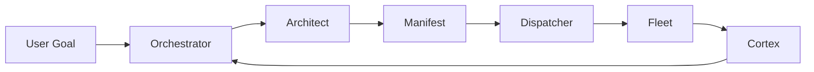

# Euxis

**Enterprise Unified eXecution Intelligence System**

Version 0.0.7

[![Version][version-badge]][version-url]
[![License][license-badge]][license-url]
[![Platform][platform-badge]][platform-url]
[![Agents][agents-badge]][agents-url]

## Overview

Euxis gives you 38 specialist AI agents that plan, execute, and verify engineering tasks — so you can focus on what matters. Every decision is tracked. Every outcome is verified. Every lesson is remembered.

Build faster. Ship with confidence.

## Table of Contents

- [Overview](#overview)
- [Get Started](#get-started)
- [How It Works](#how-it-works)
- [Your Specialist Team](#your-specialist-team)
- [Usage](#usage)
- [Persistent Memory](#persistent-memory)
- [Parallel Execution](#parallel-execution)
- [Automatic Task Routing](#automatic-task-routing)
- [Security Model](#security-model)
- [Team Coordination](#team-coordination)
- [CLI Tools](#cli-tools)
- [Directory Structure](#directory-structure)
- [Advanced](#advanced)
- [License](#license)

---

## Get Started

### Prerequisites

You need Bash 4.0+ and Python 3.8+, plus at least one AI provider.

Euxis works with 10 providers out of the box:

| Provider | CLI | Best For |
|:---------|:----|:---------|
| [Claude][claude-url] | `claude` | Reasoning, architecture, strategy |
| [Gemini][gemini-url] | `gemini` | Research with large context |
| [Ollama][ollama-url] | `ollama` | Local inference, zero cost |
| [Codex CLI][codex-url] | `codex` | OpenAI models |
| [OpenCode][opencode-url] | `opencode` | Local code generation |
| [Qwen Code][qwen-url] | `qwen` | Open-source agentic coding (256K context) |
| [Crush][crush-url] | `crush` | Multi-model TUI agent |
| [Kilo Code][kilo-url] | `kilo` | Multi-model agentic CLI |
| [Amazon Q][amazon-q-url] | `kiro-cli` | AWS-native developer agent |
| [Goose][goose-url] | `goose` | Open-source MCP-native agent |

### Install

```bash
git clone https://github.com/sebastienrousseau/euxis.git ~/.euxis
~/.euxis/setup.sh
```

Add `~/bin` to your `PATH`:

```bash
echo 'export PATH="$HOME/bin:$PATH"' >> ~/.profile && source ~/.profile
```

### Verify

```bash
euxis-health      # 8-point fleet integrity check
euxis-certify     # Full 6-gate certification pipeline
```

---

## How It Works

Euxis follows a three-step cycle: **Plan — Decompose — Delegate**.

Your goal enters the orchestrator, gets broken into tasks, and flows through the fleet. The Cortex remembers everything across sessions.

| Layer | Component | Purpose |
|:------|:----------|:--------|
| Memory | **Cortex** | Tri-typed vector store with persistent semantic recall |
| Control | **Dispatcher** | Parallel execution of agent mission manifests |
| Interface | **Link** | Terminal, voice, and IDE integration |



---

## Your Specialist Team

38 agents across three tiers: 7 core agents govern the fleet, 20 default agents execute domain work, and 11 on-demand agents provide specialized leverage when explicitly invoked.

**Authority Model:** Each agent class has distinct operational rules and scope boundaries. Core agents define direction and may block progress, while default agents execute within their domain when triggered. On-demand agents provide specialized leverage only when explicitly invoked.

For the complete agent registry, governance rules, and authority model, see [CONSTITUTION.md](CONSTITUTION.md).

---

## Usage

### Single Agent Tasks

```bash
euxis orchestrator "Refactor the login module to use JWT"
euxis architect "Review the authentication module"
euxis bug-fixer "Fix the null pointer in user.py"
```

### Research and Analysis

```bash
euxis deep-researcher "Compare Python PDF parsing libraries with benchmarks"
```

### Parallel Fleet Deployment

```bash
euxis-dispatch manifest.json         # Parallel execution from manifest
euxis-squad deploy build "Fix auth"  # Deploy entire squad
euxis-combo run steve-jobs "Design onboarding flow"  # Sequential chain
```

**For complete usage examples, workflow patterns, and advanced features, see [User Guide](docs/user-guide.md) and [Fleet Guide](docs/fleet-guide.md).**

---

## Persistent Memory

The Cortex provides tri-typed semantic memory that persists across sessions. Memories are classified as episodic (events), semantic (facts), or procedural (workflows) to ensure agents recall the right knowledge at the right time.

**For complete memory commands, type classification, and usage examples, see [User Guide](docs/user-guide.md#tri-typed-memory-system).**

---

## Parallel Execution

The fleet supports three coordination modes: **hierarchical** (central orchestrator), **mesh** (specialists coordinate directly), and **federated** (autonomous cross-project). Dispatches display a live status table with per-agent progress.

```bash
euxis-dispatch plan.json                      # hierarchical (default)
euxis-dispatch --mode mesh plan.json          # peer-to-peer
euxis-dispatch --mode federated plan.json     # cross-project
```

**For dispatch modes, coordination rules, and the full quality assurance protocol, see [Fleet Guide](docs/fleet-guide.md).**

---

## Automatic Task Routing

When you omit the provider argument, Euxis routes each agent to the optimal tier automatically. S-Tier agents (orchestrator, architect, reviewer) route to `claude`; research agents route to `gemini`; coding agents to `goose`; utility agents to `ollama`. An explicit provider argument always overrides tiering.

```bash
euxis architect "Review the auth module"          # auto routes to claude
euxis bug-fixer "Fix user.py" gemini              # explicit override
```

**For the complete intelligence tiering matrix and provider details, see [User Guide](docs/user-guide.md#ai-provider-matrix).**

---

## Security Model

Euxis enforces a zero-trust security model at every layer.

- **Input Validation.** Agent names validated against `[a-zA-Z0-9_-]`. Shell metacharacters rejected.
- **Script Hardening.** Every bash script enforces `set -euo pipefail`.
- **Audit Trails.** Every action logged to `~/.euxis/data/projects/<project>/<agent>/audit.md`.
- **Human-in-the-Loop.** `euxis-sync-docs` validates AI output against forbidden patterns and requires explicit approval.
- **Security Probes.** `euxis-audit-run` tests for shell injection, path traversal, and null byte injection.

---

## Team Coordination

Euxis provides multiple ways to coordinate agent work: individual agents, cross-functional squads, multi-phase playbooks, and sequential combos.

**Squads:** Six cross-functional teams (Vision, Build, Quality, Growth, Experience, Specialist) with clear ownership and purpose.

**Playbooks:** Phased workflows that activate squads in sequence for complex projects like product launches or incident response.

**Combos:** Lightweight sequential agent chains for focused tasks like "Steve Jobs" (vision to polished review) or "Fort Knox" (maximum security assurance).

**For complete delegation patterns, squad details, playbook phases, and combo chains, see [Fleet Guide](docs/fleet-guide.md).**


---

## CLI Tools

Euxis provides a complete command-line interface with 30+ tools for agent management, orchestration, and quality assurance.

**Core Commands:**
- `euxis <agent> <task> [provider]` — Deploy any agent with automatic intelligence routing
- `euxis-ui` — Interactive Mission Control TUI
- `euxis-health` — 8-point fleet integrity check
- `euxis-certify` — 6-gate certification pipeline

**For the complete CLI reference with all commands, options, and usage examples, see [User Guide](docs/user-guide.md).**

---

## Directory Structure

```
~/.euxis/
├── bin/                       Executable tools (30+ tools, symlinked to ~/bin/)
│   ├── lib/                   Shared shell libraries
│   └── hooks/                 Git hooks (prepare-commit-msg)
├── config/                    Operational configuration
│   ├── codex/                 Prompt template library + manifest
│   ├── patterns/              11 validation patterns (54 detection rules)
│   ├── playbooks/             Phased squad activation definitions (8 playbooks)
│   ├── templates/             Reusable scaffolds (ADR, prompt, playbook, pattern)
│   └── branding/              Canonical branding signature
├── data/                      Runtime & persistent state (git-ignored)
│   ├── cortex/                ChromaDB vector DB + GraphRAG knowledge graph
│   ├── projects/              Per-project agent output, audit trails, memory
│   ├── lifecycle/             Agent state files + transition log
│   ├── bus/                   Async message bus pipes + topic registry
│   └── perf/                  Performance metrics (JSONL)
├── docs/                      All documentation
│   ├── adr/                   Architecture decision records
│   ├── audits/                Session audits + release readiness reports
│   ├── benchmarks/            Performance benchmarks + verification scripts
│   ├── manifests/             Upgrade manifestos
│   └── *.md                   Guides (user, fleet, UI, cross-platform, API, lib-arch)
├── prompts/                   Agent intelligence
│   ├── core/                  7 core agents (authority-bearing)
│   ├── fleet/                 31 agents (20 default + 11 on-demand)
│   └── protocols/             Shared protocol and common instructions
├── tests/                     Quality assurance
│   ├── lib/                   16 test suites (363 assertions)
│   └── golden/                Golden datasets for evaluation
├── deploy/                    Docker & deployment configuration
├── registry.json              Master agent registry
├── capabilities.json          Capability tags and tool mapping
├── squads.json                Squad and combo registry
└── CONSTITUTION.md            Fleet governance and authority model
```

---

## Advanced

### Voice Mode

Run completely offline with Piper TTS and Faster-Whisper.

```bash
euxis-voice
```

### Continuous Improvement

```bash
euxis-kaizen              # 4-gate improvement cycle
euxis-daemon              # Periodic kaizen (default: 30 min)
euxis-daemon 3600         # Custom interval in seconds
```

### Conflict Resolution

When agents produce conflicting outputs, Euxis resolves them systematically:

1. **Domain Priority.** Primary scope agent wins.
2. **Evidence Weight.** Verified data over inference over heuristic.
3. **Negotiation Round.** Agents produce conflict responses (max 1 round).
4. **Human Escalation.** Both positions presented if unresolved.

---

## License

Copyright (c) 2026 Sebastien Rousseau. All rights reserved.

Governed by the `librarian` agent. Documentation auto-synced via `euxis-sync-docs`.

<!-- Reference Links -->

[version-badge]: https://img.shields.io/badge/version-0.0.7-blue?style=for-the-badge
[version-url]: https://github.com/sebastienrousseau/euxis/releases

[license-badge]: https://img.shields.io/badge/license-proprietary-green?style=for-the-badge
[license-url]: https://github.com/sebastienrousseau/euxis/blob/main/LICENSE

[platform-badge]: https://img.shields.io/badge/platform-macOS%20%7C%20Linux%20%7C%20WSL-lightgrey?style=for-the-badge
[platform-url]: https://github.com/sebastienrousseau/euxis

[agents-badge]: https://img.shields.io/badge/agents-38-blueviolet?style=for-the-badge
[agents-url]: https://github.com/sebastienrousseau/euxis/blob/main/docs/fleet-guide.md

[claude-url]: https://docs.anthropic.com/en/docs/claude-cli
[gemini-url]: https://github.com/google-gemini/gemini-cli
[ollama-url]: https://ollama.com/
[codex-url]: https://github.com/openai/codex
[opencode-url]: https://github.com/opencode-ai/opencode
[qwen-url]: https://github.com/QwenLM/qwen-code
[crush-url]: https://github.com/charmbracelet/crush
[kilo-url]: https://github.com/Kilo-Org/kilocode
[amazon-q-url]: https://github.com/aws/amazon-q-developer-cli
[goose-url]: https://github.com/block/goose
