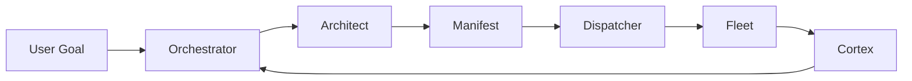

# Euxis

**Enterprise Unified eXecution Intelligence System**

Version 0.0.6

[![Version][version-badge]][version-url]
[![License][license-badge]][license-url]
[![Platform][platform-badge]][platform-url]
[![Agents][agents-badge]][agents-url]

## Overview

Euxis gives you 31 specialist AI agents that plan, execute, and verify engineering tasks — so you can focus on what matters. Every decision is tracked. Every outcome is verified. Every lesson is remembered.

Build faster. Ship with confidence.

## Table of Contents

- [Overview](#overview)
- [Get Started](#get-started)
- [How It Works](#how-it-works)
- [Your Specialist Team](#your-specialist-team)
- [Usage](#usage)
- [Persistent Memory](#persistent-memory)
- [Parallel Execution](#parallel-execution)
- [Built-In Quality Assurance](#built-in-quality-assurance)
- [Automatic Task Routing](#automatic-task-routing)
- [Security Model](#security-model)
- [Squads](#squads)
- [Playbooks](#playbooks)
- [Combos](#combos)
- [Codex](#codex)
- [CLI Reference](#cli-reference)
- [Directory Structure](#directory-structure)
- [Advanced](#advanced)
- [License](#license)

---

## Get Started

### Prerequisites

You need Bash 4.0+ and Python 3.8+, plus at least one AI provider.

Euxis works with 10 providers out of the box:

| Provider | CLI | Best For |
|:---------|:----|:---------|
| [Claude][claude-url] | `claude` | Reasoning, architecture, strategy |
| [Gemini][gemini-url] | `gemini` | Research with large context |
| [Ollama][ollama-url] | `ollama` | Local inference, zero cost |
| [Codex CLI][codex-url] | `codex` | OpenAI models |
| [OpenCode][opencode-url] | `opencode` | Local code generation |
| [Qwen Code][qwen-url] | `qwen` | Open-source agentic coding (256K context) |
| [Crush][crush-url] | `crush` | Multi-model TUI agent |
| [Kilo Code][kilo-url] | `kilo` | Multi-model agentic CLI |
| [Amazon Q][amazon-q-url] | `kiro-cli` | AWS-native developer agent |
| [Goose][goose-url] | `goose` | Open-source MCP-native agent |

### Install

```bash
git clone https://github.com/sebastienrousseau/euxis.git ~/.euxis
~/.euxis/setup.sh
```

Add `~/bin` to your `PATH`:

```bash
echo 'export PATH="$HOME/bin:$PATH"' >> ~/.profile && source ~/.profile
```

### Verify

```bash
euxis-health      # 8-point fleet integrity check
euxis-certify     # Full 6-gate certification pipeline
```

---

## How It Works

Euxis follows a three-step cycle: **Plan — Decompose — Delegate**.

Your goal enters the orchestrator, gets broken into tasks, and flows through the fleet. The Cortex remembers everything across sessions.

| Layer | Component | Purpose |
|:------|:----------|:--------|
| Memory | **Cortex** | Tri-typed vector store with persistent semantic recall |
| Control | **Dispatcher** | Parallel execution of agent mission manifests |
| Interface | **Link** | Terminal, voice, and IDE integration |



---

## Your Specialist Team

31 agents across three tiers: 7 core agents govern the fleet, 17 default agents execute domain work, and 7 on-demand agents provide leverage when invoked. See [CONSTITUTION.md](CONSTITUTION.md) for the authoritative governance document.

### Core (7) — Authority-bearing, always present

| Agent | Domain |
|:------|:-------|
| `orchestrator` | Task decomposition, delegation, and synthesis |
| `architect` | Software architecture, patterns, and design decisions |
| `product-manager` | Intent, scope, and prioritization |
| `reviewer` | Truth & quality gate |
| `librarian` | Memory optimization, knowledge continuity, documentation governance |
| `compliance-officer` | Legal, privacy, and regulatory authority |
| `system-critic` | Risk, pre-mortems, counter-bias |

### Default (17) — Auto-available, task-triggered

| Agent | Domain |
|:------|:-------|
| `automation-engineer` | CI/CD, IaC, Docker, Terraform |
| `bug-fixer` | Debugging, root cause analysis, surgical fixes |
| `data-steward` | Observability, telemetry, structured logging |
| `edge-hunter` | Security analysis, boundary testing, vulnerability assessment |
| `incident-commander` | Incident response, root cause analysis, post-mortems |
| `legacy-maintainer` | Legacy code documentation, non-breaking upgrades |
| `perf-optimizer` | Latency, throughput, and memory profiling |
| `qa-coordinator` | End-to-end testing coordination, quality gates |
| `release-manager` | Changelogs, semantic versioning, release coordination |
| `security-lead` | Security policy, threat governance, edge-hunter dispatch |
| `tech-writer` | Documentation, tutorials, API reference |
| `unit-tester` | Test coverage, reliability, regression prevention |
| `ux-sentinel` | Accessibility (WCAG 2.1 AA), responsive testing |
| `cli-ui-artisan` | Terminal UI design and keyboard navigation |
| `web-ui-architect` | Web UI components and design systems |
| `theming-and-motion-engineer` | Theming, color systems, and animation |
| `interaction-and-input-specialist` | Keyboard navigation and input handling |

### On-Demand (7) — Explicit invocation only

| Agent | Domain |
|:------|:-------|
| `brand-evangelist` | Brand voice, product storytelling, design system advocacy |
| `butler` | TTS-optimized summarization for spoken output |
| `deep-researcher` | Iterative multi-pass research with cross-validation |
| `devrel-advocate` | Developer relations, tutorials, demos |
| `globalization-lead` | i18n, l10n, RTL support, Unicode validation |
| `growth-marketer` | SEO, funnel optimization, go-to-market strategy |
| `social-manager` | Platform-native content and community engagement |

See the [Fleet Guide](FLEET_GUIDE.md) for delegation patterns, provider tiering, and workflow examples.

---

## Usage

### Route a task

Send work to any agent by name. Euxis assembles the prompt, routes to the right provider, and captures the output.

```bash
euxis orchestrator "Refactor the login module to use JWT."
euxis architect "Review the authentication module."
euxis bug-fixer "Fix the null pointer in user.py."
```

### Research first, build second

```bash
euxis deep-researcher "Compare the top 3 Python PDF parsing libraries. Include benchmarks."
```

### Deploy the fleet

Generate a plan, then execute agents in parallel.

```bash
euxis architect "Audit this repo for security gaps. Output a MISSION MANIFEST." > plan.json
euxis-dispatch plan.json
```

### Convene experts

Run a structured 3-round adversarial debate.

```bash
euxis-council "Should we migrate from Postgres to MongoDB for logging?"
```

### Self-correcting loops

Run an agent with verification checkpoints that retry on failure.

```bash
euxis-loop bug-fixer "Fix parser.py" "pytest tests/test_parser.py" 3
```

---

## Persistent Memory

The Cortex gives every agent access to persistent semantic memory across sessions. Memories are classified into three types so agents recall the right knowledge at the right time.

| Type | Purpose | Example |
|:-----|:--------|:--------|
| `episodic` | Specific events and outcomes | "Bug #42 fixed by null-check in auth.py" |
| `semantic` | Persistent facts and relationships | "The auth module uses JWT with RS256" |
| `procedural` | Reusable workflows and contraindications | "Never retry with expired tokens" |

```bash
euxis-cortex remember "Project uses hexagonal architecture" "architect" --type semantic
euxis-cortex recall "authentication" --type procedural
euxis-cortex stats
```

---

## Parallel Execution

The fleet supports three coordination modes. Choose the one that fits your workflow. Dispatches display a live status table with per-agent progress.

| Mode | Behavior |
|:-----|:----------|
| `hierarchical` | All agents report to the orchestrator. Default. |
| `mesh` | Agents with dispatch authority coordinate sub-workflows directly. |
| `federated` | Agents operate autonomously across project boundaries. |

```bash
euxis-dispatch plan.json                      # hierarchical
euxis-dispatch --mode mesh plan.json          # peer-to-peer
euxis-dispatch --mode federated plan.json     # cross-project
```

Dispatch-authority agents: `architect`, `qa-coordinator`, `incident-commander`, `release-manager`.

---

## Built-In Quality Assurance

Every agent applies three verification layers before delivering output.

1. **Internal Consistency.** Every claim is supported by a ReAct observation. No fabricated paths.
2. **Cross-Reference.** Key findings are checked against Cortex memories. Contradictions are flagged.
3. **Evaluator Checkpoint.** The `reviewer` validates synthesized outputs before delivery.

On failure, agents generate structured reflections stored as procedural memory:

```
REFLEXION:          Root cause — not the symptom
EVIDENCE:           Specific observation that revealed the failure
STRATEGY:           Concrete alternative approach
CONTRAINDICATION:   What to never repeat
```

---

## Automatic Task Routing

When you omit the provider argument, Euxis routes each agent to the optimal tier automatically.

| Tier | Agents | Provider | Rationale |
|:-----|:-------|:---------|:----------|
| S-Tier: Strategic | orchestrator, architect, product-manager, reviewer, system-critic, compliance-officer | `claude` | Strongest reasoning |
| A-Tier: Research | deep-researcher | `gemini` | 2M token context window |
| A-Tier: Enterprise | incident-commander | `amazon-q` | AWS-native developer agent |
| B-Tier: Coding | bug-fixer, unit-tester, automation-engineer | `goose` | Agent-native tool use |
| B-Tier: Local Code | legacy-maintainer | `opencode` | Fast local code models |
| B-Tier: Math/Logic | perf-optimizer, data-steward | `qwen` | Algorithmic optimization |
| C-Tier: Utility | butler, librarian, tech-writer | `ollama` | Zero latency, no cost |
| Standard | All others | `claude` | General-purpose fallback |

An explicit provider argument always overrides tiering. Tasks marked P0 always route to S-Tier.

```bash
euxis architect "Review the auth module"          # auto routes to claude
euxis bug-fixer "Fix user.py" gemini              # explicit override
euxis perf-optimizer "Optimize queries" qwen      # explicit override
```

---

## Security Model

Euxis enforces a zero-trust security model at every layer.

- **Input Validation.** Agent names validated against `[a-zA-Z0-9_-]`. Shell metacharacters rejected.
- **Script Hardening.** Every bash script enforces `set -euo pipefail`.
- **Audit Trails.** Every action logged to `~/.euxis/projects/<project>/<agent>/audit.md`.
- **Human-in-the-Loop.** `euxis-sync-docs` validates AI output against forbidden patterns and requires explicit approval.
- **Security Probes.** `euxis-audit-run` tests for shell injection, path traversal, and null byte injection.

---

## Squads

Five cross-functional teams, each with a lead and a clear purpose. Deploy an entire squad with one command.

| Squad | Purpose | Lead | Members |
|:------|:--------|:-----|:--------|
| Vision | Strategy & Discovery | `orchestrator` | orchestrator, architect, product-manager, deep-researcher |
| Build | Engineering & Execution | `bug-fixer` | bug-fixer, legacy-maintainer, automation-engineer, unit-tester |
| Quality | Assurance & Security | `reviewer` | reviewer, qa-coordinator, edge-hunter, compliance-officer, perf-optimizer |
| Growth | Branding & Documentation | `tech-writer` | tech-writer, brand-evangelist, social-manager, devrel-advocate, growth-marketer, globalization-lead |
| Experience | UI Excellence & Interaction Design | `web-ui-architect` | web-ui-architect, cli-ui-artisan, theming-and-motion-engineer, interaction-and-input-specialist, ux-sentinel |

```bash
euxis-squad list                            # All squads
euxis-squad info vision                     # Details
euxis-squad deploy build "Fix auth module"  # Deploy
euxis-squad validate                        # Cross-check against registry
```

---

## Playbooks

Playbooks activate squads in sequence for repeatable workflows. Each phase generates a dispatch manifest with checkpoints that gate progression.

| Playbook | Sequence | Use Case |
|:---------|:---------|:---------|
| Zero to One | Vision -> Build -> Quality -> Growth | Full product launch |
| Legacy Overhaul | Build -> Quality -> Vision | Modernize legacy systems |
| Red Alert | Quality -> Build -> Vision | Emergency incident response |

```bash
euxis-playbook list                                             # Available playbooks
euxis-playbook info zero-to-one                                 # Phase breakdown
euxis-playbook run zero-to-one "Launch auth service" --dry-run  # Preview manifests
euxis-playbook run zero-to-one "Launch auth service"            # Execute all phases
euxis-playbook status                                           # Session history
```

---

## Combos

Combos are sequential agent chains. Each agent receives the previous agent's output as context. Fast, focused, no manifest overhead.

| Combo | Chain | Use Case |
|:------|:------|:---------|
| Steve Jobs | product-manager -> architect -> brand-evangelist -> reviewer | Vision to polished review |
| Fort Knox | edge-hunter -> compliance-officer -> qa-coordinator -> reviewer | Maximum security assurance |
| Content Factory | tech-writer -> brand-evangelist -> social-manager -> reviewer | End-to-end content production |
| Jony Ive | web-ui-architect -> theming-and-motion-engineer -> interaction-and-input-specialist -> ux-sentinel -> reviewer | Apple-level UI from design system to polished interaction |

```bash
euxis-combo list                                      # Available combos
euxis-combo info steve-jobs                           # Chain detail
euxis-combo run steve-jobs "Design a new onboarding"  # Execute chain
```

---

## Codex

The Codex is a prompt template library. Battle-tested templates that force agents into structured, high-quality output patterns.

| Template | Agent | Use Case |
|:---------|:------|:---------|
| System X-Ray | `architect` | Trace critical data paths, dependency maps, risk zones |
| Surgical Strike | `bug-fixer` | Zero-side-effect fix with blast radius verification |
| Executive Decision | `deep-researcher` | Weighted decision matrix with 2026 data and ADR |
| Feature Factory | 5-agent chain | End-to-end feature delivery from research to review |

```bash
euxis-codex list                                                    # All templates
euxis-codex info xray                                               # Details and variables
euxis-codex show surgical-fix                                       # Raw template
euxis-codex run xray CODEX_CODEBASE_PATH=./src CODEX_ENTRY_POINT=main.py  # Execute
```

---

## CLI Reference

### Core

| Command | Description |
|:--------|:------------|
| `euxis <agent> <task> [provider]` | Route a task to any agent |
| `euxis-ui` | Interactive Mission Control TUI |

### Quality

| Command | Description |
|:--------|:------------|
| `euxis-health` | Fleet integrity check |
| `euxis-lint` | Static analysis |
| `euxis-certify` | 6-gate certification pipeline |
| `euxis-test-infra` | Infrastructure unit tests |
| `euxis-bench` | Performance benchmarking |
| `euxis-audit-run` | Security audit with probes |
| `euxis-git-guard` | Pre-commit safety checks |
| `euxis-verify` | Output verification |
| `euxis-polish` | Prompt polishing |

### Orchestration

| Command | Description |
|:--------|:------------|
| `euxis-dispatch [--mode MODE] <manifest>` | Parallel agent execution |
| `euxis-loop <agent> <task> <verify> [retries]` | Autonomous retry loop |
| `euxis-council "<topic>"` | Multi-agent adversarial debate |
| `euxis-bus <cmd> [args]` | Async pub/sub message bus |
| `euxis-graph <cmd> [args]` | GraphRAG knowledge graph |
| `euxis-squad <cmd> [args]` | Squad management and deployment |
| `euxis-playbook <cmd> [args]` | Phased squad execution via playbooks |
| `euxis-combo <cmd> [args]` | Sequential agent chain execution |
| `euxis-codex <cmd> [args]` | Prompt template library |
| `euxis-hooks <cmd> [--repo PATH]` | Git hook management |
| `euxis-synthesize <cmd> [args]` | Dynamic agent composition |

### Memory

| Command | Description |
|:--------|:------------|
| `euxis-cortex <cmd> [args] [--type TYPE]` | Tri-typed vector memory |

### Maintenance

| Command | Description |
|:--------|:------------|
| `euxis-kaizen` | Continuous self-improvement cycle |
| `euxis-daemon [interval]` | Periodic kaizen with fail-safe |
| `euxis-optimize` | System-wide tune-up |
| `euxis-sync-docs` | Documentation sync with approval gate |
| `euxis-deploy` | Docker Compose enterprise deployment |

### Interface

| Command | Description |
|:--------|:------------|
| `euxis-voice` | Offline voice interface (Whisper + Piper) |
| `euxis-gym <agent> <test> [provider]` | Agent evaluation and A/B testing |

---

## Directory Structure

```
~/.euxis/
├── bin/                    Executable tools (symlinked to ~/bin/)
│   ├── euxis.sh            Core CLI — routing, prompt assembly, output capture
│   ├── euxis-ui            Mission Control TUI
│   ├── euxis-cortex        Semantic memory (vector store)
│   ├── euxis-dispatch      Parallel agent execution
│   ├── euxis-loop          Autonomous retry loop
│   ├── euxis-council       Multi-agent consensus
│   ├── euxis-bus           Async message bus
│   ├── euxis-graph         GraphRAG knowledge graph
│   ├── euxis-synthesize    Dynamic agent composition
│   ├── euxis-squad         Squad management and deployment
│   ├── euxis-playbook      Phased squad execution
│   ├── euxis-combo         Sequential agent chains
│   ├── euxis-codex         Prompt template library
│   ├── euxis-hooks         Git hook management
│   └── ...                 30 tools total
├── codex/                     Prompt template library
│   ├── codex.json             Template manifest
│   ├── architect/             Architecture templates
│   ├── code/                  Code templates
│   ├── research/              Research templates
│   └── combo/                 Multi-agent chain templates
├── branding/
│   └── signature.txt          Canonical branding signature
├── hooks/
│   └── prepare-commit-msg     Auto-appends signature to commits
├── .github/
│   └── pull_request_template.md  Branded PR template
├── squads.json             Squad and combo registry
├── playbooks/              Phased squad activation definitions
│   ├── zero-to-one.json    Vision → Build → Quality → Growth
│   ├── legacy-overhaul.json Build → Quality → Vision
│   └── red-alert.json      Quality → Build → Vision
├── prompts/
│   ├── core/               7 core agents (authority-bearing)
│   ├── fleet/              20 agents (13 default + 7 on-demand)
│   └── protocols/          Shared protocol and common instructions
├── tests/
│   └── golden/             Golden datasets for evaluation
├── registry.json           Master agent registry
├── USER_GUIDE.md           Complete CLI and agent reference
├── FLEET_GUIDE.md          Delegation patterns and workflows
└── cortex_db/              ChromaDB vector database (git-ignored)
```

---

## Advanced

### Voice Mode

Run completely offline with Piper TTS and Faster-Whisper.

```bash
euxis-voice
```

### Continuous Improvement

```bash
euxis-kaizen              # 4-gate improvement cycle
euxis-daemon              # Periodic kaizen (default: 30 min)
euxis-daemon 3600         # Custom interval in seconds
```

### Conflict Resolution

When agents produce conflicting outputs, Euxis resolves them systematically:

1. **Domain Priority.** Primary scope agent wins.
2. **Evidence Weight.** Verified data over inference over heuristic.
3. **Negotiation Round.** Agents produce conflict responses (max 1 round).
4. **Human Escalation.** Both positions presented if unresolved.

---

## License

Copyright (c) 2026 Sebastien Rousseau. All rights reserved.

Governed by the `librarian` agent. Documentation auto-synced via `euxis-sync-docs`.

<!-- Reference Links -->

[version-badge]: https://img.shields.io/badge/version-0.0.6-blue?style=for-the-badge
[version-url]: https://github.com/sebastienrousseau/euxis/releases

[license-badge]: https://img.shields.io/badge/license-proprietary-green?style=for-the-badge
[license-url]: https://github.com/sebastienrousseau/euxis/blob/main/LICENSE

[platform-badge]: https://img.shields.io/badge/platform-macOS%20%7C%20Linux%20%7C%20WSL-lightgrey?style=for-the-badge
[platform-url]: https://github.com/sebastienrousseau/euxis

[agents-badge]: https://img.shields.io/badge/agents-31-blueviolet?style=for-the-badge
[agents-url]: https://github.com/sebastienrousseau/euxis/blob/main/FLEET_GUIDE.md

[claude-url]: https://docs.anthropic.com/en/docs/claude-cli
[gemini-url]: https://github.com/google-gemini/gemini-cli
[ollama-url]: https://ollama.com/
[codex-url]: https://github.com/openai/codex
[opencode-url]: https://github.com/opencode-ai/opencode
[qwen-url]: https://github.com/QwenLM/qwen-code
[crush-url]: https://github.com/charmbracelet/crush
[kilo-url]: https://github.com/Kilo-Org/kilocode
[amazon-q-url]: https://github.com/aws/amazon-q-developer-cli
[goose-url]: https://github.com/block/goose
