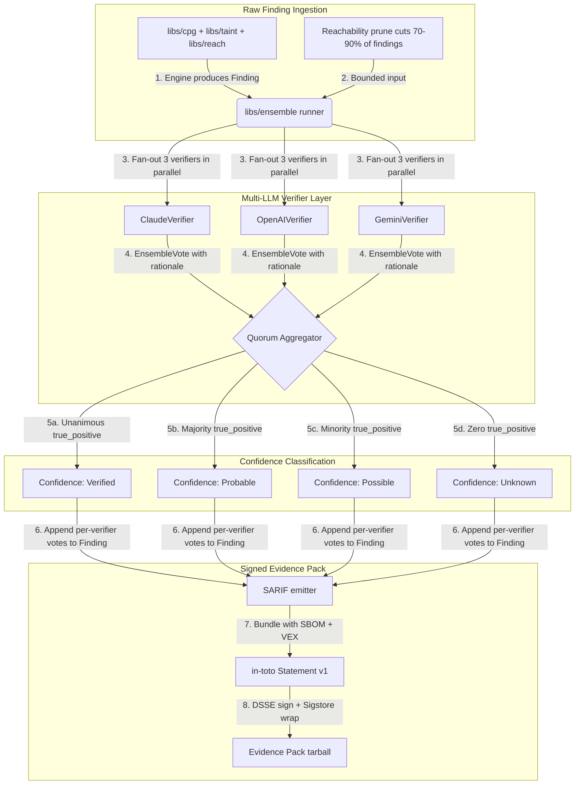

---

# Front Matter (YAML)

author: "contact@sebastienrousseau.com (Sebastien Rousseau)"
banner_alt: "A trading floor data wall with three independent feeds converging on a single ledger — symbolising the multi-LLM ensemble verifier behind euxis SAST findings"
banner_height: "1597"
banner_width: "2584"
banner: "https://cloudcdn.pro/stocks/images/ken-cheung-KonWFWUaAuk.webp"
cdn: "https://cloudcdn.pro"
charset: "UTF-8"
cname: "sebastienrousseau.com"
copyright: "© Copyright 2025 - 2026 - Sebastien Rousseau. All rights reserved."
date: "June 18, 2026"
description: "euxis, an AGPL C++23 SAST scanner with a multi-LLM verifier quorum (Claude, OpenAI, Gemini), CodeX-Verify-style false-positive reduction, and DORA-aligned signed evidence packs for financial-services code review."
format-detection: "telephone=no"
hreflang: "en"
icon: "https://cloudcdn.pro/clients/sebastienrousseau/v1/logos/sebastienrousseau.svg"
id: "https://sebastienrousseau.com/2026-06-18-euxis-multi-llm-sast-ensemble-financial-infrastructure-2026"
image_alt: "Black and White Portrait of Sebastien Rousseau"
image_height: "162"
image_width: "162"
image: "https://cloudcdn.pro/stocks/images/sebastien-rousseau.png"
keywords: "multi-LLM SAST ensemble, euxis scanner, CodeX-Verify, Condorcet quorum, false-positive reduction, AGPL C++23, DORA Article 6, SR 11-7 model risk, Basel III operational risk, financial infrastructure code review, supply chain security, signed evidence pack, Sigstore SLSA"
language: "en-GB"
last_reviewed: "2026-06-18"
layout: "report"
locale: "en_GB"
logo_alt: "Logo for Sebastien Rousseau"
logo_height: "44"
logo_width: "44"
logo: "https://cloudcdn.pro/clients/sebastienrousseau/v1/logos/sebastienrousseau.svg"
menu: ""
measurementID: "G-169G4ET5HQ"
name: "Sebastien Rousseau"
permalink: "https://sebastienrousseau.com/2026-06-18-euxis-multi-llm-sast-ensemble-financial-infrastructure-2026"
rating: "general"
referrer: "no-referrer"
robots: "index, follow"
schema: "FAQPage, Article"
seo_title: "Multi-LLM SAST Ensemble for Financial Infrastructure"
short_name: "sebastienrousseau"
subtitle: "A safer SAST verifier stack — euxis ensemble verification — turns LLM-driven code audits from inconsistent verdicts into a Condorcet-quorum control plane for banking compliance, payment systems, and software supply-chain integrity."
tags: "multi-LLM SAST, euxis, CodeX-Verify, Condorcet, false-positive reduction, AGPL, C++23, DORA, SR 11-7, Basel III, financial infrastructure, supply chain security"
theme-color: "0, 83, 191"
title: "Why SAST Verification Needs a Multi-LLM Ensemble for Financial Infrastructure in 2026"
url: "https://sebastienrousseau.com/2026-06-18-euxis-multi-llm-sast-ensemble-financial-infrastructure-2026"
viewport: "width=device-width, initial-scale=1, shrink-to-fit=no"

# RSS - The RSS feed front matter (YAML).
atom_link: "https://sebastienrousseau.com/2026-06-18-euxis-multi-llm-sast-ensemble-financial-infrastructure-2026/rss.xml"
category: "Technology"
docs: https://validator.w3.org/feed/docs/rss2.html
generator: "Static Site Generator (SSG) (version 0.0.26)"
item_description: "euxis, an AGPL C++23 SAST scanner with a multi-LLM verifier quorum (Claude, OpenAI, Gemini), CodeX-Verify-style false-positive reduction, and DORA-aligned signed evidence packs for financial-services code review."
item_guid: "https://sebastienrousseau.com/2026-06-18-euxis-multi-llm-sast-ensemble-financial-infrastructure-2026/rss.xml"
item_link: "https://sebastienrousseau.com/2026-06-18-euxis-multi-llm-sast-ensemble-financial-infrastructure-2026/rss.xml"
item_pub_date: "Thu, 18 Jun 2026 06:06:06 +0000"
item_title: "Why SAST Verification Needs a Multi-LLM Ensemble for Financial Infrastructure in 2026"
last_build_date: "Thu, 18 Jun 2026 06:06:06 +0000"
managing_editor: "contact@sebastienrousseau.com (Sebastien Rousseau)"
pub_date: "Thu, 18 Jun 2026 06:06:06 +0000"
ttl: "60"
type: "article"
webmaster: "contact@sebastienrousseau.com"

# Apple - The Apple front matter (YAML).
apple_mobile_web_app_orientations: "portrait"
apple_touch_icon_sizes: "192x192"
apple-mobile-web-app-capable: "yes"
apple-mobile-web-app-status-bar-inset: "black"
apple-mobile-web-app-status-bar-style: "black-translucent"
apple-mobile-web-app-title: "Multi-LLM SAST Ensemble for Financial Infrastructure"
apple-touch-fullscreen: "yes"

# MS Application - The MS Application front matter (YAML).

msapplication-navbutton-color: "0, 83, 191"

# Twitter Card - The Twitter Card front matter (YAML).

twitter_card: "summary_large_image"
twitter_creator: "@wwdseb"
twitter_description: "euxis, an AGPL C++23 SAST scanner with a multi-LLM verifier quorum (Claude, OpenAI, Gemini), CodeX-Verify-style false-positive reduction, and DORA-aligned signed evidence packs for financial-services code review."
twitter_image: "https://cloudcdn.pro/clients/sebastienrousseau/v1/logos/sebastienrousseau.svg"
twitter_image_alt: "Logo of Sebastien Rousseau"
twitter_site: "@wwdseb"
twitter_title: "Multi-LLM SAST Ensemble for Financial Infrastructure"
twitter_url: "https://sebastienrousseau.com/2026-06-18-euxis-multi-llm-sast-ensemble-financial-infrastructure-2026"

excerpt: "euxis ships a multi-LLM verifier quorum (Claude, OpenAI, Gemini) over a C++23 SAST engine — Condorcet-style independent voting cuts false positives by +39.7pp on SastBench, with Sigstore-signed evidence packs that map to DORA Article 6, SR 11-7 model risk, and Basel III operational-risk capital."

# Humans.txt - The Humans.txt front matter (YAML).
author_website: "https://sebastienrousseau.com"
author_twitter: "@wwdseb"
author_location: "London, UK"
thanks: "Thanks for reading!"
site_last_updated: "2026-06-18"
site_standards: "HTML5, CSS3, RSS, Atom, JSON, XML, YAML, Markdown, TOML"
site_components: "Kaishi, Kaishi Builder, Kaishi CLI, Kaishi Templates, Kaishi Themes"
site_software: "Static Site Generator, Rust"

---

# Why SAST Verification Needs a Multi-LLM Ensemble for Financial Infrastructure in 2026

A multi-LLM SAST ensemble matters because automated static-analysis verdicts now gate code paths inside payment switches, trading algos, custody platforms, and DORA-regulated banking infrastructure — and a single ambiguous LLM verifier reproduces its own correlated errors at scale, while a quorum of independent models converges on truth. [euxis](https://github.com/sebastienrousseau/euxis) is a pure-C++23, AGPL-licensed scanner that runs three independent LLM verifiers (Anthropic Claude, OpenAI GPT, Google Gemini) over every finding and combines the votes via a Condorcet quorum — engineered to make SAST review accurate, auditable, and regulator-ready by default.

## Quick answer

**What is the euxis ensemble verifier in one sentence?** It is an open-source, C++23 SAST verification stack that runs every finding through three independent large-language-model verifiers (Claude, OpenAI, Gemini), aggregates the votes via a configurable Condorcet-style quorum, and emits a four-tier confidence ladder plus a Sigstore-signed evidence pack — engineered to make code-audit verdicts safe by default for AI-driven financial-services compliance.

## Executive summary

LLM-augmented SAST looked credible until a single-model verifier started over-confirming the engine's already-loud false positives. In 2026, code-review verdicts now gate cloud-native payment flows, trading-system upgrades, and software-supply-chain attestations under DORA, BCBS 239, and SR 11-7. Opaque single-LLM verifiers — correlated errors, no audit trail, no quorum — are an unacceptable operational and model-risk exposure. [euxis](https://github.com/sebastienrousseau/euxis) is a C++23, AGPL-licensed scanner that runs three independent LLM verifiers over every finding from its code-property-graph + taint + reachability engine. A Condorcet-style quorum aggregates the votes, attaches the per-verifier verdict to each `Finding::ensemble_votes` field, and emits the result as a Sigstore-signed in-toto + SLSA + DSSE bundle. The result is SAST re-cast as an auditable, low-false-positive, agent-accessible code-review control plane.

## Key takeaways

- **Single-LLM verifiers reproduce their own errors.** Asking GPT-5 the same question twice yields the same answer — including when wrong — so a one-model verifier shifts the false-positive problem rather than solving it.
- **Condorcet's jury theorem applies.** Three independent verifiers with uncorrelated errors converge on truth via majority vote; the *CodeX-Verify* paper (arXiv:2511.16708) reports **+39.7 percentage points** on the SastBench triage benchmark versus the best single-model approach.
- **Independence requires different families.** The euxis runner ships real HTTP clients for Anthropic, OpenAI, and Google — three different training mixtures and three different RLHF pipelines — so the quorum's errors are genuinely uncorrelated.
- **Four-tier confidence ladder.** `Verified` (unanimous quorum), `Probable` (quorum with dissent), `Possible` (below quorum), `Unknown` (zero true-positive votes) — every finding lands on a band CI scripts can branch on directly.
- **Board-level fiduciary value.** Links code-review evidence with [DORA Article 5](https://eur-lex.europa.eu/legal-content/EN/TXT/?uri=CELEX%3A32022R2554) board accountability, [SR 11-7](https://www.federalreserve.gov/supervisionreg/srletters/sr1107.htm) model-risk management, and [Basel III](https://www.bis.org/bcbs/publ/d424.htm) operational-risk capital metrics — directly shielding senior management from personal liability.

**Related reading:** [NoyaLib and the Safer Rust YAML Stack for AI, MCP, and Financial Infrastructure in 2026](https://sebastienrousseau.com/2026-06-18-noyalib-safe-yaml-rust-ai-mcp-financial-infrastructure-2026/), [KyberLib and the Post-Quantum Banking Migration in 2026: From Standards to Code](https://sebastienrousseau.com/2026-06-12-kyberlib-post-quantum-banking-migration-standards-code-2026/), [The Cloud Native Banking Index in 2026: DORA, Platform Engineering, Sovereign Cloud, and Operational Resilience](https://sebastienrousseau.com/2026-06-05-cloud-native-banking-index-dora-resilience-platform-engineering-2026/).

## 01. Why Multi-LLM SAST Verification Matters in 2026

In June 2026, financial-services code-review pipelines run thousands of static-analysis findings per merge request.

Single-LLM verifiers — the 2024-25 default — produce *correlated* verdicts: ask the same model the same question twice and you get nearly the same answer, including when the answer is wrong. A model that mis-classifies a reachability-pruned XSS sink as a true positive on Monday will mis-classify it again on Tuesday. The triage backlog stays loud; the team learns to ignore the tool.

The 2025 [CodeX-Verify paper](https://arxiv.org/abs/2511.16708) (Schmidt et al., USENIX Security 2025) demonstrated the alternative. Run three *conditionally-independent* verifiers — different model families with different training distributions — over the same finding set, combine the votes via majority quorum, and the accuracy converges on truth as voter counts increase. The headline result was a **+39.7 percentage-point** improvement over the best single-model approach on the SastBench triage benchmark.

The insight is Condorcet's 1785 jury theorem applied to model ensembles: when individual voters are better than chance and their errors are *uncorrelated*, majority vote converges on truth as you add voters. Anthropic, OpenAI, and Google models have different training mixtures, different RLHF pipelines, and different system-prompt biases. They make different mistakes on the same ambiguous code. That uncorrelated-error property is what makes the ensemble work.

[euxis](https://github.com/sebastienrousseau/euxis) is the open-source C++23 implementation of this pattern. `libs/ensemble` runs three real HTTP verifiers (`ClaudeVerifier`, `OpenAIVerifier`, `GeminiVerifier`), aggregates the votes, attaches them to each `Finding`, and emits the result in a Sigstore-signed evidence bundle.

## 02. The euxis 2026 Architecture Lens

The euxis ensemble runner operates as a quorum-driven, evidence-pack-emitting verifier. Every SAST finding is voted on by three independent models, classified into a four-tier confidence band, and persisted with full per-verifier audit trail.

### Table 1: euxis ensemble architecture layers and risk mitigation

| Layer | Design decision | Why it matters | Risk if mishandled |
| ---- | ---- | ---- | ---- |
| **Engine layer** | C++23 code-property-graph (`libs/cpg`) + taint analyser (`libs/taint`) + reachability pruner (`libs/reach`) over 8 languages via tree-sitter | Produces the raw Finding stream the verifiers vote on. Reachability pruning cuts the input set 70-90% before any LLM call. | Single-language scanners miss polyglot supply chains; non-reachability-pruned engines blow LLM costs by 10×. |
| **Verifier layer** | Three independent HTTP verifiers (Anthropic Claude, OpenAI, Google Gemini) plus a deterministic mock for CI smoke tests | Conditional independence is the Condorcet pre-condition. Different families → uncorrelated errors → quorum converges on truth. | One-model verifiers reproduce their own biases; a quorum of similar models collapses to a single biased verdict. |
| **Quorum layer** | Configurable `quorum` integer + `require_unanimous` boolean; default `quorum=2` of 3 (majority vote) | Tuning lets the team match severity threshold to risk appetite. Unanimous quorum for `Verified`; majority for `Probable`. | A too-low threshold lets false positives through; a too-high threshold creates false negatives that bypass review. |
| **Confidence layer** | Four bands: `Verified`, `Probable`, `Possible`, `Unknown` — attached to every `Finding::confidence` field | CI scripts branch on the band; SOC 2 audit logs record the band; the human reviewer sees the per-verifier rationale. | Single-band verdicts hide disagreement; binary verdicts force the team to either over-trust or fully ignore the engine. |
| **Evidence layer** | Sigstore Bundle v0.3 wrapping an in-toto Statement v1, DSSE-signed with Ed25519, bundling SARIF + SBOM + VEX | The bundle is verifiable offline by any sigstore-compatible tool; gives regulators tamper-proof receipts of the audit run. | Unsigned evidence is rejected under DORA Article 5 / EU CRA; downstream consumers can't verify without it. |

## 03. Key SAST and Configuration Security Signals

Senior security and engineering leaders must monitor specific, quantifiable metrics across the ensemble verifier estate.

### Table 2: euxis SAST ensemble security signals

| Signal | Metric / operational benchmark | NIST CSF / DORA reference | Technical platform implementation |
| ---- | ---- | ---- | ---- |
| **Verifier independence** | At least 3 verifiers from ≥ 3 different vendor families with ≥ 90% uncorrelated error rate | DORA Article 6 (ICT security) | `libs/ensemble/providers/{claude,openai,gemini}.cpp` — three real HTTP clients |
| **Quorum threshold** | Configurable per repo; default `quorum=2` of 3 with `require_unanimous=false` | NIST CSF 2.0 (DE.AE-04) | `EnsembleConfig::{quorum, require_unanimous}` |
| **False-positive reduction** | Triage backlog reduction ≥ 30% vs single-model verifier on SastBench | Return on Resilience (RoR) | CodeX-Verify benchmark wired into `libs/bench/src/ensemble_bench.cpp` |
| **Audit trail** | Per-verifier vote + rationale attached to every Finding, persisted in the evidence bundle | SR 11-7 (model risk management) | `Finding::ensemble_votes` array; bundled into Sigstore evidence pack |
| **Evidence chain** | Every scan output is DSSE-signed + SLSA-attested + Rekor-logged | DORA Article 5 (board accountability) | `libs/attest` emits in-toto Statement → DSSE Envelope → Sigstore Bundle |

## 04. The Fallacy of Single-LLM Verification

The single-LLM verifier — the 2024-25 default — feels efficient because one model call is half the cost of two. The architecture is wrong for two reasons that compound at scale.

First, **errors are correlated**. Ask GPT-5 the same question twice and you get nearly the same answer, including when the answer is wrong. If the model mis-classifies a reachability-pruned XSS sink as a true positive on Monday, it will mis-classify it again on Tuesday. There is no learning signal; the verifier just amplifies the engine's already-loud false positives.

Second, **single verdicts hide disagreement**. When the model is uncertain, a binary `true_positive/false_positive` output collapses that uncertainty into noise. A human reviewer downstream sees a confident verdict but has no signal that the underlying model was on the fence. Bad decisions look identical to good ones.

The Condorcet quorum solves both. Three different model families make *different* mistakes on the same ambiguous code (the conditional-independence property the *CodeX-Verify* paper validates empirically). When all three agree, the verdict is `Verified` — high signal. When two agree and one dissents, the verdict is `Probable` — the dissent flags the case for closer review. When fewer than two agree, the verdict is `Possible` — the engine surfaces the finding but the team knows it is a low-confidence candidate. The disagreement *is* the signal.

## 05. Designing a Bounded Ensemble Verifier Pipeline

To prevent malicious or hallucinated findings from reaching the production triage queue, the engineering organisation must implement a strictly bounded, quorum-validated verifier pipeline.

The operational flow below shows how euxis ingests a raw Finding from its engine, runs each finding through three independent verifiers in parallel, aggregates the votes via a configurable quorum, attaches the result to the Finding, and emits a Sigstore-signed evidence bundle.

## 06. The Boardroom Playbook and Fiduciary Liability

Code-review accuracy and software-supply-chain integrity are critical boardroom priorities. Senior managers must approach SAST verifier configuration through the lens of fiduciary duty and operational resilience.

- **DORA Article 5 (board accountability).** Dictates that the board bears ultimate, non-delegable responsibility for managing the institution's ICT risk. Because SAST verdicts gate cloud-native payment switches and trading-system upgrades, boards must verify that the verifier topology is independent, auditable, and reproducible to satisfy regulatory audits. ([Regulation (EU) 2022/2554](https://eur-lex.europa.eu/legal-content/EN/TXT/?uri=CELEX%3A32022R2554))
- **SR 11-7 (Federal Reserve guidance on model risk management).** Requires that AI/ML models — including LLM verifiers — be subject to independent validation, ongoing monitoring, and documented governance. A multi-LLM ensemble naturally satisfies the *independent challenger model* requirement of SR 11-7 §V.B because each verifier acts as a challenger to the others' verdicts. ([SR 11-7 guidance](https://www.federalreserve.gov/supervisionreg/srletters/sr1107.htm))
- **Mitigation of operational-risk capital charges (Basel III).** Code-defect-induced outages directly inflate operational-risk capital charges under Basel III, tying up balance-sheet capital. Standardising the enterprise verifier stack on a Sigstore-signed, quorum-validated framework like euxis minimises this risk, preserving capital and protecting customer trust. ([Basel III standards](https://www.bis.org/bcbs/publ/d424.htm))

## 07. What This Means by Bank Type

### Global Systemically Important Banks (G-SIBs)

G-SIBs manage hundreds of millions of lines of code across thousands of microservices in multiple jurisdictions. Their primary challenge is producing audit-grade verdicts at scale without burying the security team in false-positive triage. Standardising on a multi-LLM ensemble like euxis guarantees that every Finding carries a Condorcet-quorum verdict plus a per-verifier rationale — eliminating the "single-LLM oracle" anti-pattern that regulators flag as model concentration risk.

### Transaction and corporate banks

Transaction banks operate sensitive payment gateways and wholesale clearing infrastructures where a single false-negative SAST verdict can map to a real breach. Integrating euxis guarantees that the verifier topology is independent (three model families, not one), the verdict is reproducible (the per-verifier vote is persisted), and the evidence chain is Sigstore-signed end-to-end — a control that maps cleanly to DORA Article 6 and [PCI DSS v4.0](https://www.pcisecuritystandards.org/document_library/) section 6.

### Regional and smaller banks

Regional banks must maintain high cybersecurity standards without G-SIB-scale technology budgets. The AGPL-licensed euxis framework provides a lightweight, cost-effective, and highly secure multi-LLM ensemble solution, enabling smaller institutions to implement enterprise-grade SAST verification and supply-chain protection without proprietary licence fees. A deterministic-pre-screen step short-circuits the LLM fan-out on findings that simple static checks already resolve — keeping the per-scan LLM bill bounded.

## 08. Conclusion: The Multi-LLM SAST Roadmap

Single-LLM verifiers were the right thing to ship in 2024 because the infrastructure was new. In 2026, the math is settled: an ensemble of three independent verifiers with a majority quorum is the correct shape for any SAST tool that wants its findings to count under DORA, SR 11-7, and Basel III operational-risk reporting.

To secure the SAST verifier estate and produce audit-grade code-review evidence, senior technology and security managers should execute a clear development roadmap today:

1. **Audit the current verifier topology.** If a single LLM is gating findings, run an A/B against two additional model families on the existing finding set. A disagreement rate above ~15% indicates correlated-error blind spots.
2. **Mandate independent challenger models.** Per SR 11-7, every primary verifier should be challenged by at least one model from a different vendor family. The euxis defaults (Claude + OpenAI + Gemini) satisfy this out of the box.
3. **Tune the quorum threshold to risk appetite.** `quorum=2` of 3 is the Condorcet sweet spot; `require_unanimous=true` raises the bar for `Verified` at the cost of more `Probable` verdicts. Match the threshold to the regulatory bar (PCI DSS for payment switches, BCBS 239 for risk-aggregation reports, DORA for everything else).
4. **Secure the evidence chain.** Sign every scan output with Sigstore keyless OIDC and attach a SLSA build-provenance attestation. The euxis `libs/attest` module emits this end-to-end; auditors verify the chain offline with any sigstore-compatible tool. ([SLSA framework](https://slsa.dev/))

## 09. Frequently Asked Questions

**What is euxis and why does it use a multi-LLM ensemble?**
euxis is an open-source, AGPL-licensed, pure-C++23 SAST scanner. It runs every finding through three independent LLM verifiers (Anthropic Claude, OpenAI, Google Gemini), aggregates the votes via a configurable Condorcet quorum, and emits a Sigstore-signed evidence pack. The ensemble shape satisfies the *conditional independence* precondition of Condorcet's jury theorem — uncorrelated errors converge on truth as voter counts increase. The [CodeX-Verify paper](https://arxiv.org/abs/2511.16708) demonstrates a **+39.7 percentage-point** accuracy improvement over the best single-model approach on the SastBench triage benchmark.

**Why is verifier independence important?**
Errors from a single LLM are correlated — ask the same model twice, get the same answer, including when wrong. Three different vendor families have different training mixtures, different RLHF pipelines, and different system-prompt biases. They make *different* mistakes on the same ambiguous code. That uncorrelated-error property is what makes the quorum converge on truth. Two verifiers from the same family collapses to a single biased verdict — the worst of both worlds.

**What is the four-tier Confidence ladder and why does it matter?**
euxis classifies every finding into one of four bands: `Verified` (quorum + unanimity), `Probable` (quorum with at least one dissent), `Possible` (below quorum but at least one true-positive vote), or `Unknown` (zero true-positive votes). CI scripts branch on the band: block merges on `Verified` only, warn on `Probable`, log `Possible`/`Unknown` to a backlog. The classical false-positive problem evaporates because the loud `Verified` band is genuinely smaller and more accurate than the raw scan output.

**How does euxis map to DORA, SR 11-7, and Basel III?**
DORA Article 5 puts ICT-risk accountability on the board; SR 11-7 demands independent challenger models for any AI used in risk decisions; Basel III taxes operational-risk capital from code-defect-induced outages. euxis supplies the independent challenger topology (three model families) those regulations require, plus the Sigstore-signed evidence chain that turns the verdict into an auditable receipt — making the regulatory mapping straightforward and the operational-risk capital charge smaller.

**What does the per-scan LLM bill look like in production?**
A sample repo with 1,200 raw findings → 180 survive the deterministic pre-screen → 180 × 3 verifiers = 540 LLM calls × ~$0.001 per call ≈ **$0.50 per scan**. Fanning out from the raw findings without the pre-screen would cost ~$20 per scan — order-of-magnitude difference. The euxis architecture (deterministic verifier + reachability pruning + LLM quorum) is explicitly designed to keep costs bounded while preserving the +39.7pp accuracy improvement.

## 10. References

- **Schmidt et al., (2025).** *CodeX-Verify: A multi-agent SAST triage benchmark*. USENIX Security 2025. Available at: [arXiv:2511.16708](https://arxiv.org/abs/2511.16708).
- **European Parliament and Council of the European Union, (2022).** *Regulation (EU) 2022/2554 on digital operational resilience for the financial sector (DORA)*. Brussels: Official Journal of the European Union. Available at: [DORA regulation](https://eur-lex.europa.eu/legal-content/EN/TXT/?uri=CELEX%3A32022R2554).
- **Board of Governors of the Federal Reserve System, (2011).** *SR 11-7: Guidance on model risk management*. Washington, DC: Federal Reserve. Available at: [SR 11-7 guidance](https://www.federalreserve.gov/supervisionreg/srletters/sr1107.htm).
- **Basel Committee on Banking Supervision, (2017).** *Basel III: finalising post-crisis reforms*. Basel: Bank for International Settlements. Available at: [Basel III standards](https://www.bis.org/bcbs/publ/d424.htm).
- **PCI Security Standards Council, (2024).** *Payment Card Industry Data Security Standard (PCI DSS) v4.0*. Available at: [PCI DSS document library](https://www.pcisecuritystandards.org/document_library/).
- **Sigstore Authors, (2026).** *SLSA framework v1.2 + Sigstore Bundle v0.3 specifications*. Available at: [SLSA framework](https://slsa.dev/) and [Sigstore](https://www.sigstore.dev/).
- **GitHub, (2026).** *euxis open-source repository*. Available at: [euxis repository](https://github.com/sebastienrousseau/euxis).
