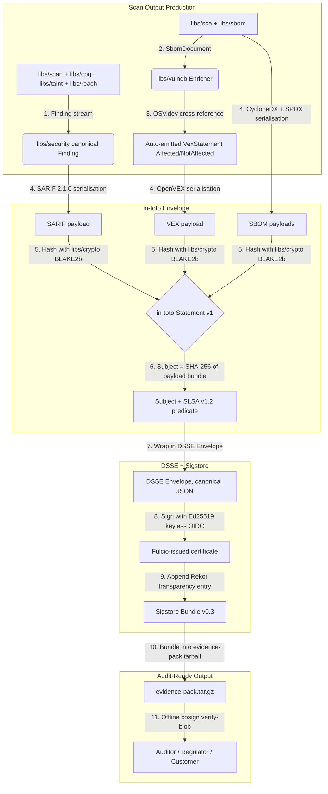

---

# Front Matter (YAML)

author: "contact@sebastienrousseau.com (Sebastien Rousseau)"
banner_alt: "An architectural lattice under low light — symbolising the in-toto Statement + DSSE Envelope + Sigstore Bundle layered chain that ties SARIF, SBOM, and VEX together into one signed evidence pack"
banner_height: "1597"
banner_width: "2584"
banner: "https://cloudcdn.pro/stocks/images/ken-cheung-KonWFWUaAuk.webp"
cdn: "https://cloudcdn.pro"
charset: "UTF-8"
cname: "sebastienrousseau.com"
copyright: "© Copyright 2025 - 2026 - Sebastien Rousseau. All rights reserved."
date: "June 18, 2026"
description: "euxis bundles SARIF + CycloneDX + SPDX + OpenVEX into a single in-toto v1 + SLSA v1.2 + DSSE-signed + Sigstore-attested evidence pack — engineered for DORA Article 5 board accountability, BCBS 239 risk reporting, EU CRA compliance, and PCI DSS v4.0 supply-chain attestations."
format-detection: "telephone=no"
hreflang: "en"
icon: "https://cloudcdn.pro/clients/sebastienrousseau/v1/logos/sebastienrousseau.svg"
id: "https://sebastienrousseau.com/2026-06-18-euxis-signed-evidence-pack-financial-infrastructure-2026"
image_alt: "Black and White Portrait of Sebastien Rousseau"
image_height: "162"
image_width: "162"
image: "https://cloudcdn.pro/stocks/images/sebastien-rousseau.png"
keywords: "signed evidence pack, SARIF SBOM VEX, in-toto Statement v1, SLSA v1.2 build provenance, DSSE envelope, Sigstore Bundle v0.3, Rekor transparency log, Fulcio keyless OIDC, euxis libs attest, DORA Article 5, BCBS 239, EU CRA, PCI DSS v4.0, Basel III operational risk, supply chain security"
language: "en-GB"
last_reviewed: "2026-06-18"
layout: "report"
locale: "en_GB"
logo_alt: "Logo for Sebastien Rousseau"
logo_height: "44"
logo_width: "44"
logo: "https://cloudcdn.pro/clients/sebastienrousseau/v1/logos/sebastienrousseau.svg"
menu: ""
measurementID: "G-169G4ET5HQ"
name: "Sebastien Rousseau"
permalink: "https://sebastienrousseau.com/2026-06-18-euxis-signed-evidence-pack-financial-infrastructure-2026"
rating: "general"
referrer: "no-referrer"
robots: "index, follow"
schema: "FAQPage, Article"
seo_title: "Signed SARIF + SBOM + VEX Evidence Pack for Financial Infrastructure"
short_name: "sebastienrousseau"
subtitle: "A safer software-supply-chain attestation stack — euxis signed evidence packs — turns SARIF, SBOM, and VEX from unsigned artefacts into one cryptographically-verifiable receipt for DORA, BCBS 239, EU CRA, and PCI DSS v4.0 audits."
tags: "signed evidence pack, SARIF, SBOM, VEX, in-toto, SLSA, DSSE, Sigstore, Fulcio, Rekor, euxis, DORA, BCBS 239, EU CRA, PCI DSS, Basel III, supply chain security"
theme-color: "0, 83, 191"
title: "Why SARIF, SBOM, and VEX Need a Signed Evidence Pack for Financial Infrastructure in 2026"
url: "https://sebastienrousseau.com/2026-06-18-euxis-signed-evidence-pack-financial-infrastructure-2026"
viewport: "width=device-width, initial-scale=1, shrink-to-fit=no"

# RSS - The RSS feed front matter (YAML).
atom_link: "https://sebastienrousseau.com/2026-06-18-euxis-signed-evidence-pack-financial-infrastructure-2026/rss.xml"
category: "Technology"
docs: https://validator.w3.org/feed/docs/rss2.html
generator: "Static Site Generator (SSG) (version 0.0.26)"
item_description: "euxis bundles SARIF + CycloneDX + SPDX + OpenVEX into a single in-toto v1 + SLSA v1.2 + DSSE-signed + Sigstore-attested evidence pack — engineered for DORA Article 5 board accountability, BCBS 239 risk reporting, EU CRA compliance, and PCI DSS v4.0 supply-chain attestations."
item_guid: "https://sebastienrousseau.com/2026-06-18-euxis-signed-evidence-pack-financial-infrastructure-2026/rss.xml"
item_link: "https://sebastienrousseau.com/2026-06-18-euxis-signed-evidence-pack-financial-infrastructure-2026/rss.xml"
item_pub_date: "Thu, 18 Jun 2026 06:06:06 +0000"
item_title: "Why SARIF, SBOM, and VEX Need a Signed Evidence Pack for Financial Infrastructure in 2026"
last_build_date: "Thu, 18 Jun 2026 06:06:06 +0000"
managing_editor: "contact@sebastienrousseau.com (Sebastien Rousseau)"
pub_date: "Thu, 18 Jun 2026 06:06:06 +0000"
ttl: "60"
type: "article"
webmaster: "contact@sebastienrousseau.com"

# Apple - The Apple front matter (YAML).
apple_mobile_web_app_orientations: "portrait"
apple_touch_icon_sizes: "192x192"
apple-mobile-web-app-capable: "yes"
apple-mobile-web-app-status-bar-inset: "black"
apple-mobile-web-app-status-bar-style: "black-translucent"
apple-mobile-web-app-title: "Signed SARIF + SBOM + VEX Evidence Pack for Financial Infrastructure"
apple-touch-fullscreen: "yes"

# MS Application - The MS Application front matter (YAML).

msapplication-navbutton-color: "0, 83, 191"

# Twitter Card - The Twitter Card front matter (YAML).

twitter_card: "summary_large_image"
twitter_creator: "@wwdseb"
twitter_description: "euxis bundles SARIF + CycloneDX + SPDX + OpenVEX into a single in-toto v1 + SLSA v1.2 + DSSE-signed + Sigstore-attested evidence pack — engineered for DORA Article 5 board accountability, BCBS 239 risk reporting, EU CRA compliance, and PCI DSS v4.0 supply-chain attestations."
twitter_image: "https://cloudcdn.pro/clients/sebastienrousseau/v1/logos/sebastienrousseau.svg"
twitter_image_alt: "Logo of Sebastien Rousseau"
twitter_site: "@wwdseb"
twitter_title: "Signed SARIF + SBOM + VEX Evidence Pack for Financial Infrastructure"
twitter_url: "https://sebastienrousseau.com/2026-06-18-euxis-signed-evidence-pack-financial-infrastructure-2026"

excerpt: "euxis wraps SARIF + CycloneDX 1.6 + SPDX 3.0.1 + OpenVEX into a single in-toto v1 + SLSA v1.2 + DSSE + Sigstore Bundle v0.3 chain, signed with Sigstore keyless OIDC and Rekor-logged — engineered as the cryptographically-verifiable evidence layer for DORA, BCBS 239, EU CRA, and PCI DSS v4.0 audits."

# Humans.txt - The Humans.txt front matter (YAML).
author_website: "https://sebastienrousseau.com"
author_twitter: "@wwdseb"
author_location: "London, UK"
thanks: "Thanks for reading!"
site_last_updated: "2026-06-18"
site_standards: "HTML5, CSS3, RSS, Atom, JSON, XML, YAML, Markdown, TOML"
site_components: "Kaishi, Kaishi Builder, Kaishi CLI, Kaishi Templates, Kaishi Themes"
site_software: "Static Site Generator, Rust"

---

# Why SARIF, SBOM, and VEX Need a Signed Evidence Pack for Financial Infrastructure in 2026

A signed software-supply-chain evidence pack matters because three documents — the [SARIF](https://docs.oasis-open.org/sarif/sarif/v2.1.0/) finding report, the [CycloneDX](https://cyclonedx.org/) or [SPDX](https://spdx.dev/) SBOM, and the [OpenVEX](https://github.com/openvex/spec) exemption document — now travel together at the end of every CI scan, yet none of them are cryptographically signed by default. A misconfigured S3 bucket or a compromised CI runner can rewrite the bytes between scan and audit, and the downstream regulator has no mathematical way to detect the tampering. [euxis](https://github.com/sebastienrousseau/euxis) is a pure-C++23, AGPL-licensed scanner that wraps all three documents into a single in-toto v1 + SLSA v1.2 + DSSE-signed + Sigstore Bundle v0.3 chain — verifiable offline by any sigstore-compatible tool, mapped directly to DORA Article 5 board accountability and EU Cyber Resilience Act (CRA) attestation requirements.

## Quick answer

**What is the euxis signed evidence pack in one sentence?** It is a tamper-proof bundle that wraps every SAST scan's SARIF findings, CycloneDX 1.6 + SPDX 3.0.1 SBOMs, and OpenVEX exception document into a single in-toto Statement v1 → SLSA v1.2 build-provenance predicate → DSSE Envelope (Ed25519) → Sigstore Bundle v0.3 with Fulcio-issued certificate and Rekor transparency-log entries — verifiable offline by any sigstore-compatible tool and engineered as the cryptographic evidence layer for DORA, BCBS 239, EU CRA, and PCI DSS v4.0 financial-services audits.

## Executive summary

Three documents travel together at the end of every CI scan in 2026: the SARIF finding report, the CycloneDX or SPDX SBOM, and the OpenVEX statement that exempts the false positives. None of them are signed by default. The downstream consumer — an auditor, a regulator, a compliance team, the next CI job in a multi-repo pipeline — has no cryptographic way to tell whether the bytes they received are the bytes the scanner produced. The 2026 EU Cyber Resilience Act mandates signed evidence for high-criticality products; DORA Article 5 puts ICT-risk accountability on the bank board; BCBS 239 demands data-quality controls on risk reporting; PCI DSS v4.0 section 6 requires supply-chain attestations. [euxis](https://github.com/sebastienrousseau/euxis) ships `libs/attest`, the C++23 implementation of the in-toto + SLSA + DSSE + Sigstore layered envelope. Every scan optionally produces a single tarball that bundles SARIF + SBOM + VEX + the attestation chain, signed once and verifiable offline by any sigstore-compatible tool. The result is software-supply-chain evidence re-cast as an auditable, regulator-ready, agent-accessible attestation control plane.

## Key takeaways

- **Three unsigned documents is not enough.** SARIF + SBOM + VEX are individually well-specified but unsigned. Any party with write access to the artefact storage can edit the bytes and the downstream consumer has no way to detect it.
- **Layered envelope is the right shape.** Sigstore Bundle v0.3 → DSSE Envelope → in-toto Statement v1 → SLSA v1.2 build-provenance predicate ties all three documents to a single signature with full audit trail.
- **Keyless signing eliminates the key-management problem.** Fulcio-issued certificates from OIDC identity claims plus Rekor transparency-log entries give the verifier everything needed to validate the chain offline, no contact to a vendor service required.
- **OSV.dev enrichment auto-generates VEX.** The euxis `libs/vulndb` module queries OSV.dev per PURL, auto-emits `VexStatement{Affected}` for every matched vulnerability — closing the only remaining gap on the supply-chain evidence story.
- **Board-level value through cryptographic receipts.** Maps directly to [DORA Article 5](https://eur-lex.europa.eu/legal-content/EN/TXT/?uri=CELEX%3A32022R2554) board accountability, [BCBS 239](https://www.bis.org/publ/bcbs239.htm) risk-reporting integrity, [EU CRA](https://eur-lex.europa.eu/legal-content/EN/TXT/?uri=CELEX%3A32024R2847) attestation requirements, and [PCI DSS v4.0](https://www.pcisecuritystandards.org/document_library/) section 6 supply-chain controls.

**Related reading:** [NoyaLib and the Safer Rust YAML Stack for AI, MCP, and Financial Infrastructure in 2026](https://sebastienrousseau.com/2026-06-18-noyalib-safe-yaml-rust-ai-mcp-financial-infrastructure-2026/), [KyberLib and the Post-Quantum Banking Migration in 2026: From Standards to Code](https://sebastienrousseau.com/2026-06-12-kyberlib-post-quantum-banking-migration-standards-code-2026/), [The Cloud Native Banking Index in 2026: DORA, Platform Engineering, Sovereign Cloud, and Operational Resilience](https://sebastienrousseau.com/2026-06-05-cloud-native-banking-index-dora-resilience-platform-engineering-2026/).

## 01. Why Signed Evidence Packs Matter in 2026

In June 2026, every CI artefact directory looks the same:

```
artefacts/
├── findings.sarif          # SARIF 2.1.0 from the SAST engine
├── sbom.cdx.json           # CycloneDX 1.6 from the SBOM tool
├── sbom.spdx.json          # SPDX 3.0.1 (some teams emit both)
└── vex.openvex.json        # OpenVEX statement marking exemptions
```

These four files are correct, structured, and individually well-specified by their respective standards bodies (OASIS, OWASP CycloneDX TC, Linux Foundation SPDX, OpenVEX working group). None of them carry a signature by default. Anyone with write access to the artefact storage — a misconfigured S3 bucket, a compromised CI runner, a malicious dependency in the workflow — can edit the bytes and the downstream consumer has no way to detect it.

Regulators have noticed. The 2026 EU Cyber Resilience Act (Regulation (EU) 2024/2847) *requires* signed evidence for high-criticality products from December 2027. SOC 2 Type II auditors will accept unsigned artefacts but flag them. NIST SSDF treats unsigned attestations as advisory, not normative. The market has been quietly converging on *attested* outputs for two years; the tooling has not caught up.

[euxis](https://github.com/sebastienrousseau/euxis) closes the gap. The `libs/attest` module wraps SARIF + SBOM + VEX into a single in-toto v1 + SLSA v1.2 + DSSE-signed + Sigstore-attested evidence pack — verifiable offline by any sigstore-compatible tool, with the same `cosign verify-blob` command that already validates binary releases.

## 02. The euxis 2026 Evidence-Pack Architecture Lens

The euxis evidence pack operates as a layered cryptographic envelope. Each layer adds one trust signal — the SARIF/SBOM/VEX payload, the in-toto Subject digest, the SLSA build-provenance predicate, the DSSE signature, the Fulcio certificate chain, the Rekor transparency-log entries — without rewriting the underlying documents.

### Table 1: euxis evidence-pack architecture layers and risk mitigation

| Layer | Design decision | Why it matters | Risk if mishandled |
| ---- | ---- | ---- | ---- |
| **Payload layer** | SARIF 2.1.0 + CycloneDX 1.6 + SPDX 3.0.1 + OpenVEX (OASIS / CycloneDX / SPDX / OpenVEX working groups) | All four documents already produced by `libs/scan`, `libs/sbom`, `libs/vulndb`. No format invention needed. | Re-inventing the document format breaks downstream tooling interoperability. |
| **Subject layer** | in-toto Statement v1 with subject = SHA-256 digest of every artefact in the bundle (`libs/attest/statement.hpp`) | Ties the cryptographic envelope to the exact bytes of the payload. A single-byte tamper invalidates the digest. | Subject mismatch lets a tampered payload pass envelope verification. |
| **Provenance layer** | SLSA v1.2 build-provenance predicate (builder ID, build-type URI, invocation parameters, resolved materials) (`libs/attest/slsa.hpp`) | Records *who* built the artefact, *what* tool, *which* inputs. Auditor verifies the entire chain end-to-end. | Missing provenance means the auditor cannot trace the artefact back to its source. |
| **Signature layer** | DSSE Envelope (`libs/attest/dsse.hpp`) wrapping the in-toto Statement, signed with Ed25519 (`libs/crypto`) | Cryptographic signature over the canonical-JSON payload. Verifiable with the signer's public key alone. | Plain JSON signatures are not canonical and verification breaks on whitespace differences. |
| **Trust layer** | Sigstore Bundle v0.3 (`libs/attest/bundle.hpp`) carrying Fulcio cert chain + Rekor entries | Keyless OIDC signing eliminates key-management. Rekor entries give offline-verifiable transparency. | Long-lived signing keys leak; without transparency logs, a leaked key signs forever. |

## 03. Key Supply-Chain Evidence Signals

Senior security and compliance leaders must monitor specific, quantifiable metrics across the software-supply-chain attestation estate.

### Table 2: euxis supply-chain evidence signals

| Signal | Metric / operational benchmark | NIST CSF / DORA reference | Technical platform implementation |
| ---- | ---- | ---- | ---- |
| **Signed evidence coverage** | 100% of release artefacts ship with a Sigstore Bundle v0.3 | DORA Article 5 (board accountability) | `actions/attest-build-provenance@v2` in `.github/workflows/release.yml` |
| **SBOM completeness** | CycloneDX 1.6 + SPDX 3.0.1 emitted for every release; PURL coverage ≥ 95% of dependency tree | NIST CSF 2.0 (ID.AM-02) | `libs/sbom/cyclonedx.hpp`, `libs/sbom/spdx.hpp` |
| **VEX auto-emission** | Every affected component gets a `VexStatement{Affected}`; OSV.dev enrichment runs against every PURL | BCBS 239 (risk reporting accuracy) | `libs/vulndb/enricher.hpp` |
| **Offline verifiability** | Verification chain validates without contact to a vendor service; Rekor entries cached locally | DORA Article 30 (third-party ICT risk) | `cosign verify-blob` + cached Rekor Merkle root |
| **Builder-identity provenance** | Every SLSA build-provenance predicate records the CI runner identity + builder version | EU CRA Article 14 (attestation) | `actions/attest-build-provenance@v2` |

## 04. The Fallacy of Unsigned SBOM and VEX

The 2024-25 default — unsigned SARIF + unsigned SBOM + unsigned VEX — was credible only while the regulator clock was on early-2026 timelines. The 2026 EU CRA, DORA enforcement window, and PCI DSS v4.0 transition collectively move the deadline forward.

An unsigned SBOM has three structural failure modes that compound at scale. First, **opaque mutation**. The CI artefact directory is writable by every step in the workflow. A malicious dependency that gains code execution inside the workflow can rewrite the SBOM to remove itself from the dependency graph; the downstream auditor sees a clean tree. Second, **document drift between scan and verification**. The auditor receives the SBOM weeks or months after the scan; the original bytes may have been rotated through storage tiers, re-encoded, or partially corrupted, and there is no cryptographic anchor to detect it. Third, **forge-and-replay**. A compromised supply chain can fabricate a clean SBOM that matches a public release, defeating the entire purpose of the document.

The euxis approach — *layered cryptographic envelope* — closes all three failure modes simultaneously. The in-toto Statement Subject digest covers the exact bytes of the payload (defeats opaque mutation). The Sigstore Bundle's Fulcio certificate ties the signature to a verified OIDC identity at signing time (defeats forge-and-replay). The Rekor transparency log gives the auditor a verifiable timestamp the original signer cannot retroactively deny (defeats document drift). The verifier needs only the Fulcio root certificate and a cached Rekor Merkle root — no contact to a vendor service required.

The discipline is end-to-end in `libs/attest`. The in-toto Statement carries the payload digest plus a SLSA v1.2 build-provenance predicate. The DSSE Envelope wraps the Statement and signs it with the operator's Ed25519 key (or Sigstore's ephemeral keyless OIDC certificate). The Sigstore Bundle wraps the Envelope, the Fulcio cert chain, and one or more Rekor entries. The whole chain serialises to a single `.tar.gz` plus a `.sigstore.json` sidecar — one artefact, one verification step.

## 05. Designing a Bounded Signed Evidence Pipeline

To prevent unsigned or tampered SBOM/VEX artefacts from reaching the regulator's audit queue, the engineering organisation must implement a strictly bounded, in-toto-chained evidence pipeline.

The operational flow below shows how euxis ingests a raw scan output, layers the in-toto Statement → SLSA predicate → DSSE Envelope → Sigstore Bundle envelope, signs with keyless OIDC, logs the entry to Rekor, and emits a single verifiable tarball.



## 06. The Boardroom Playbook and Fiduciary Liability

Software-supply-chain attestation integrity is a critical boardroom priority. Senior managers must approach SBOM + VEX + SARIF signing through the lens of fiduciary duty and operational resilience.

- **DORA Article 5 (board accountability).** Dictates that the board bears ultimate, non-delegable responsibility for managing the institution's ICT risk. Software-supply-chain attestation evidence is the cryptographic receipt that demonstrates the bank's third-party software inventory is auditable and tamper-evident — a control that auditors directly cite against Article 5 compliance. ([Regulation (EU) 2022/2554](https://eur-lex.europa.eu/legal-content/EN/TXT/?uri=CELEX%3A32022R2554))
- **EU Cyber Resilience Act Article 14 (attestation requirements).** The CRA, effective December 2027, mandates that manufacturers of products with digital elements provide *signed* SBOMs and *signed* security attestations for every release. Unsigned evidence will not satisfy the conformity-assessment requirement. The euxis evidence pack is the exact shape the CRA's implementing acts will accept. ([Regulation (EU) 2024/2847](https://eur-lex.europa.eu/legal-content/EN/TXT/?uri=CELEX%3A32024R2847))
- **BCBS 239 (risk data aggregation and reporting).** Requires that risk reporting and infrastructure metrics be accurate, complete, and generated under strict data-quality controls. The Sigstore-signed evidence pack provides the cryptographic anchor that any third-party risk-reporting auditor needs to verify the SBOM was not tampered between scan and audit. ([BCBS 239 standard](https://www.bis.org/publ/bcbs239.htm))
- **PCI DSS v4.0 Section 6 (supply-chain security).** Requires that every software component used in a payment-card environment is inventoried and authenticated. A signed SBOM that the bank's PCI auditor can verify offline closes the supply-chain-attestation requirement of PCI DSS v4.0 §6.5. ([PCI DSS document library](https://www.pcisecuritystandards.org/document_library/))
- **Mitigation of operational-risk capital charges (Basel III).** Supply-chain-breach-induced outages directly inflate operational-risk capital charges under Basel III, tying up balance-sheet capital. Standardising the supply-chain attestation stack on a cryptographically-anchored evidence pack like euxis minimises this risk, preserves capital, and protects customer trust. ([Basel III standards](https://www.bis.org/bcbs/publ/d424.htm))

## 07. What This Means by Bank Type

### Global Systemically Important Banks (G-SIBs)

G-SIBs manage SBOMs across thousands of microservices and tens of thousands of third-party dependencies in multiple jurisdictions. Their primary challenge is producing a defensible supply-chain audit trail across the entire estate without burying the compliance team in unsigned JSON files. Standardising on a Sigstore-signed evidence pack like euxis guarantees that every CI artefact ships with a cryptographically-anchored chain — eliminating the "unsigned-SBOM" gap that EU CRA auditors will flag as conformity-assessment failures from December 2027.

### Transaction and corporate banks

Transaction banks operate sensitive payment gateways and wholesale clearing infrastructures where a single tampered SBOM can hide a malicious dependency in a deployed binary. Integrating euxis guarantees that every release artefact ships with an SLSA-attested build provenance, a DSSE-signed in-toto Statement, and Fulcio-issued certificate — a control that maps directly to DORA Article 5 + Article 30, PCI DSS v4.0 §6, and the SR 11-7 third-party risk-management requirements.

### Regional and smaller banks

Regional banks must maintain high cybersecurity standards without G-SIB-scale technology budgets. The AGPL-licensed euxis framework provides a lightweight, cost-effective, and highly secure Sigstore-aligned evidence-pack solution, enabling smaller institutions to implement enterprise-grade supply-chain attestation without proprietary licence fees. The keyless-OIDC signing path means no HSM, no key-rotation runbook, and no per-release manual signing step — the CI runner's GitHub OIDC identity is enough.

## 08. Conclusion: The Signed Evidence Roadmap

The unsigned-SBOM era ends when the regulators show up. The infrastructure is ready now. The tooling has to ship.

To produce audit-grade software-supply-chain evidence and protect the institution from EU CRA conformity-assessment failures, senior technology and security managers should execute a clear development roadmap today:

1. **Audit the current SBOM signing posture.** If a release artefact ships an unsigned SBOM, count the number of months until December 2027 EU CRA enforcement. The euxis evidence pack closes the gap in a single CI workflow edit.
2. **Adopt keyless OIDC signing.** Use Sigstore Fulcio + the GitHub Actions OIDC identity provider. No HSM, no long-lived signing keys, no key-rotation playbook. The `actions/attest-build-provenance@v2` action already does this for binary release tarballs in `.github/workflows/release.yml`.
3. **Wire OSV.dev enrichment to auto-generate VEX.** Every Component in the SBOM gets a VEX statement (Affected, NotAffected, or UnderInvestigation). The euxis `libs/vulndb` module does this end-to-end against OSV.dev's public API.
4. **Verify offline before shipping.** Every release pipeline should include a verification step that runs `cosign verify-blob` against the just-signed evidence pack. Pipeline fails if the chain does not validate. Auditors run the same command; the pipeline test catches the failure mode first.

## 09. Frequently Asked Questions

**What is the euxis signed evidence pack and why does it matter?**
A single tarball that bundles SARIF + CycloneDX 1.6 + SPDX 3.0.1 + OpenVEX outputs, wrapped in an in-toto Statement v1 → SLSA v1.2 build-provenance predicate → DSSE Envelope (Ed25519) → Sigstore Bundle v0.3 with Fulcio-issued certificate and Rekor transparency-log entries. The chain is verifiable offline by any sigstore-compatible tool (`cosign`, `slsa-verifier`, `in-toto verify`). It matters because the 2026 EU Cyber Resilience Act mandates signed evidence for high-criticality products from December 2027, and unsigned SBOMs will not satisfy conformity assessment.

**Why is layered signing better than a single signature over the bundle?**
Three reasons. (1) The in-toto Statement Subject digest covers the *exact bytes* of the payload — a single-byte tamper invalidates verification. (2) The SLSA build-provenance predicate ties the artefact to a specific CI runner identity and a specific build invocation; the auditor verifies *who built it* not just *what was built*. (3) The Sigstore Bundle's Rekor transparency-log entry gives the auditor a verifiable timestamp the original signer cannot retroactively deny — defeating forge-and-replay attacks.

**What does the verifier need to validate offline?**
Three artefacts. (1) The evidence-pack tarball (the signed payload). (2) The Fulcio root certificate (publicly distributed; pinned in the verifier). (3) A cached Rekor Merkle root (refreshable from Sigstore's public log; the auditor confirms the bundle's transparency entry is in the log). No contact to a vendor service required. `cosign verify-blob --bundle evidence-pack.sigstore.json evidence-pack.tar.gz` runs the full chain.

**How does euxis auto-generate the VEX statements?**
The `libs/vulndb` module queries OSV.dev per PURL during the enrichment pass. For every component returned with a vulnerability match, the enricher emits a `VexStatement{status=Affected, vulnerability=GHSA-id, product_purls=[component.purl]}`. With `emit_not_affected=true`, clean components also get a `VexStatement{NotAffected, justification=ComponentNotPresent}` for positive audit-trail proof. The whole pipeline runs end-to-end in `euxis check --enrich`.

**How does the evidence pack map to DORA, EU CRA, BCBS 239, and PCI DSS?**
DORA Article 5 puts ICT-risk accountability on the board; the evidence pack is the cryptographic receipt the board uses to demonstrate compliance. EU CRA Article 14 mandates signed attestations from December 2027; the euxis evidence pack is the exact shape conformity assessments will accept. BCBS 239 demands data-quality controls on risk reporting; the in-toto Subject digest guarantees the SBOM was not tampered. PCI DSS v4.0 §6.5 requires supply-chain attestations for payment-card environments; the keyless OIDC signing path satisfies the requirement without HSM provisioning.

## 10. References

- **OASIS, (2020).** *SARIF v2.1.0 specification*. Available at: [SARIF spec](https://docs.oasis-open.org/sarif/sarif/v2.1.0/).
- **CycloneDX Authors, (2024).** *CycloneDX v1.6 Bill of Materials Standard*. OWASP. Available at: [CycloneDX](https://cyclonedx.org/).
- **Linux Foundation, (2024).** *SPDX v3.0.1 specification*. Available at: [SPDX](https://spdx.dev/).
- **OpenVEX Authors, (2024).** *OpenVEX specification v0.2.0*. Available at: [OpenVEX spec](https://github.com/openvex/spec).
- **European Parliament and Council of the European Union, (2022).** *Regulation (EU) 2022/2554 on digital operational resilience for the financial sector (DORA)*. Brussels: Official Journal of the European Union. Available at: [DORA regulation](https://eur-lex.europa.eu/legal-content/EN/TXT/?uri=CELEX%3A32022R2554).
- **European Parliament and Council of the European Union, (2024).** *Regulation (EU) 2024/2847 on horizontal cybersecurity requirements for products with digital elements (Cyber Resilience Act)*. Brussels: Official Journal of the European Union. Available at: [EU CRA regulation](https://eur-lex.europa.eu/legal-content/EN/TXT/?uri=CELEX%3A32024R2847).
- **Basel Committee on Banking Supervision, (2013).** *Principles for effective risk data aggregation and risk reporting (BCBS 239)*. Basel: Bank for International Settlements. Available at: [BCBS 239 standard](https://www.bis.org/publ/bcbs239.htm).
- **PCI Security Standards Council, (2024).** *Payment Card Industry Data Security Standard (PCI DSS) v4.0*. Available at: [PCI DSS document library](https://www.pcisecuritystandards.org/document_library/).
- **Sigstore Authors, (2026).** *SLSA framework v1.2 + Sigstore Bundle v0.3 + Fulcio + Rekor specifications*. Available at: [Sigstore](https://www.sigstore.dev/) and [SLSA framework](https://slsa.dev/).
- **GitHub, (2026).** *euxis open-source repository*. Available at: [euxis repository](https://github.com/sebastienrousseau/euxis).
