# Euxis Architecture

Comprehensive architectural documentation for the Euxis multi-provider AI agent orchestration framework.

**Version:** 0.0.8
**Framework Size:** ~1,270 LOC (8 library modules + main entry point)
**Agent Count:** 50 (12 core + 38 fleet)

---

## System Architecture Overview

The Euxis framework is organized into five distinct layers, each with specific responsibilities. The CLI layer provides the user interface, shell libraries handle core logic, the optional Python TUI offers rich visualization, the data layer manages persistence, and the provider layer abstracts AI model interactions.

## Gateway Control Plane (v0.1)

Euxis introduces a minimal Gateway control plane to front agent execution with a WebSocket surface and health endpoint. The Gateway is a thin runtime that delegates execution to existing Euxis CLI entry points.

**Responsibilities:**
- Accept WebSocket connections and validate auth headers.
- Provide a health endpoint for liveness checks.
- Route inbound frames to `euxis-dispatch` or `euxis-squad` (future).

**Entry Point:**
- `euxis-gateway run` (see `docs/reference/gateway-cli.md`)

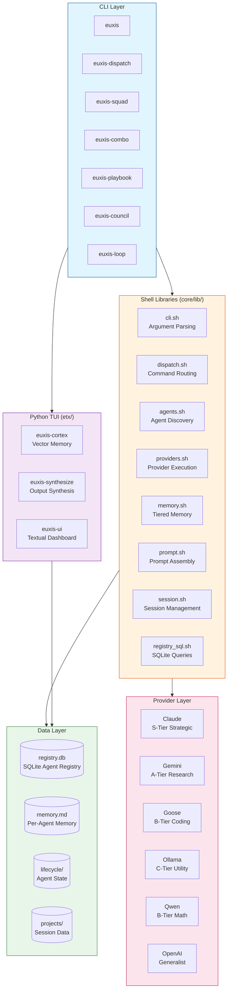

### Layer Responsibilities

| Layer | Components | Purpose |
|-------|-----------|---------|
| **CLI** | `euxis`, `euxis-dispatch`, `euxis-squad`, `euxis-combo`, `euxis-playbook` | User-facing commands for agent invocation and orchestration |
| **Shell Libraries** | `cli.sh`, `dispatch.sh`, `agents.sh`, `providers.sh`, `memory.sh` | Core framework logic implemented in pure Bash |
| **Python TUI** | `euxis-cortex`, `euxis-synthesize`, `euxis-ui` | Optional rich interfaces requiring Python venv |
| **Data Layer** | `registry.db`, `memory.md`, `lifecycle/`, `projects/` | Persistent storage for agents, memory, and sessions |
| **Provider Layer** | Claude, Gemini, Goose, Ollama, Qwen, OpenAI | External AI model backends |

---

## Agent Coordination Flow

Euxis supports four distinct coordination patterns, each optimized for different use cases. Single agent dispatch is the simplest, while playbooks enable complex multi-phase workflows.

### Single Agent Dispatch

Direct invocation of a single agent for a specific task.

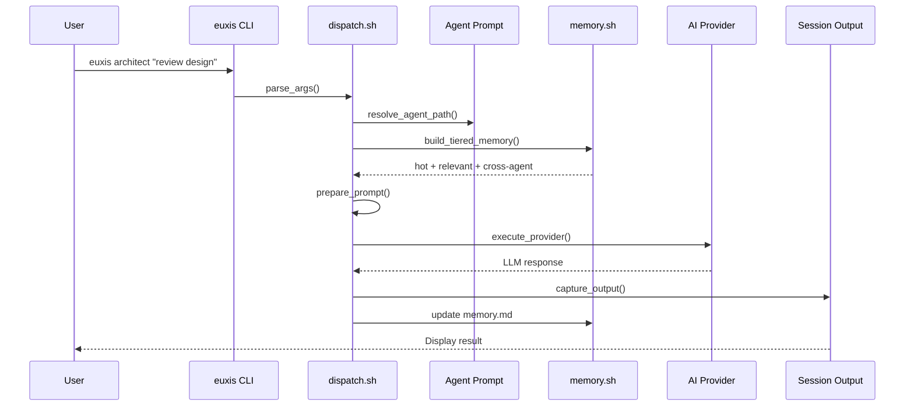

### Squad Parallel Deployment

Multiple agents execute simultaneously with a designated lead agent receiving priority.

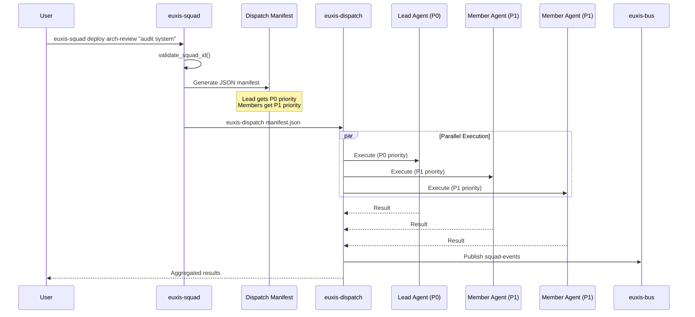

### Combo Sequential Chain

Agents execute in sequence, with each agent receiving the output of the previous agent as context.

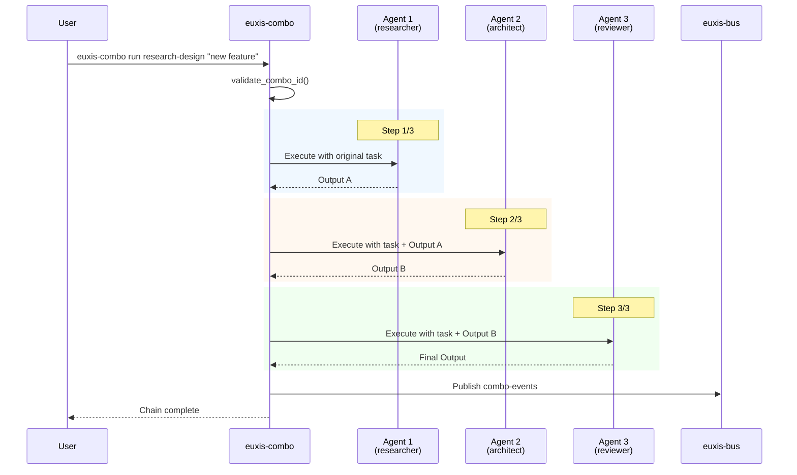

### Playbook Multi-Phase Execution

Complex workflows with multiple phases, checkpoints, and failure handling.

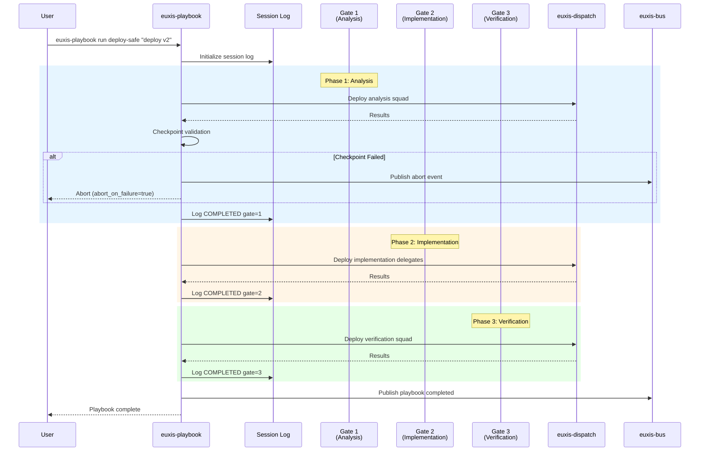

---

## Memory System Architecture

Euxis implements a sophisticated three-tier memory system inspired by MemGPT, enabling agents to maintain context across sessions while managing memory efficiently.

### Three-Tier Memory Model

```mermaid
flowchart TB
    subgraph Task["Incoming Task"]
        task_input[Task: "fix auth bug"]
    end

    subgraph HotMemory["Tier 1: Hot Memory"]
        direction TB
        hot_desc["Most Recent 20 Entries<br/>Always Included"]
        hot_data["tail -n 20 memory.md"]
    end

    subgraph RelevantMemory["Tier 2: Relevant Memory"]
        direction TB
        rel_desc["Keyword-Matched Entries<br/>Full Memory Search"]
        keywords["Extract keywords >= 5 chars"]
        grep_search["grep -iE pattern memory.md"]
        keywords --> grep_search
    end

    subgraph CrossAgent["Tier 3: Cross-Agent Memory"]
        direction TB
        cross_desc["Sibling Agent Memories<br/>Read-Only Context"]
        sibling1["architect/memory.md"]
        sibling2["reviewer/memory.md"]
        sibling3["tester/memory.md"]
    end

    subgraph Assembled["Assembled Memory Context"]
        prompt["### Tier 1: Hot Memory (Recent)<br/>...<br/>### Tier 2: Relevant Memory<br/>...<br/>### Tier 3: Cross-Agent Context<br/>..."]
    end

    task_input --> HotMemory
    task_input --> RelevantMemory
    task_input --> CrossAgent

    HotMemory --> Assembled
    RelevantMemory --> Assembled
    CrossAgent --> Assembled

    style HotMemory fill:#ffcdd2,stroke:#c62828
    style RelevantMemory fill:#fff9c4,stroke:#f9a825
    style CrossAgent fill:#c8e6c9,stroke:#2e7d32
    style Assembled fill:#e3f2fd,stroke:#1565c0
```

### Memory Types and Operations

```mermaid
flowchart LR
    subgraph Types["Memory Entry Types"]
        episodic["EPISODIC<br/>Session events, task outcomes"]
        semantic["SEMANTIC<br/>Facts, knowledge, relationships"]
        procedural["PROCEDURAL<br/>Learned patterns, contraindications"]
        reflection["REFLECTION<br/>Agent self-assessment"]
    end

    subgraph Operations["Memory Operations"]
        direction TB
        prune["prune_memory()<br/>Remove old entries<br/>Keep REFLECTION/CONTRAINDICATION"]
        drift["detect_semantic_drift()<br/>Find contradictions"]
        resolve["resolve_memory_contradiction()<br/>Supersede, keep_both, reject"]
        evolve["auto_evolve_graph()<br/>Extract entities<br/>Update knowledge graph"]
    end

    subgraph Retention["Retention Policy"]
        direction TB
        permanent["Permanent<br/>REFLECTION<br/>CONTRAINDICATION"]
        recent["Recent<br/>Last 100 entries"]
        pruned["Pruned<br/>Old entries removed"]
    end

    Types --> Operations
    Operations --> Retention

    style episodic fill:#e1f5fe
    style semantic fill:#fff3e0
    style procedural fill:#f3e5f5
    style reflection fill:#e8f5e9
```

### Memory Pruning Strategy

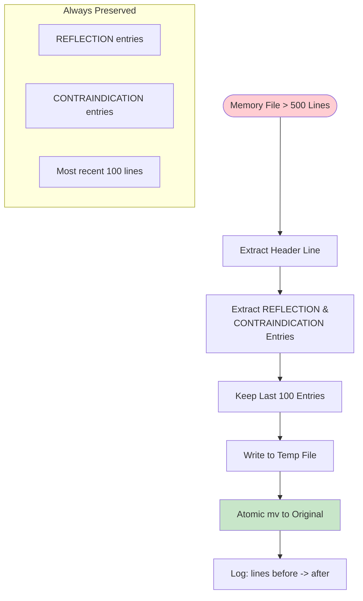

### Semantic Drift Detection

When new information potentially contradicts existing memory, the system detects and resolves conflicts.

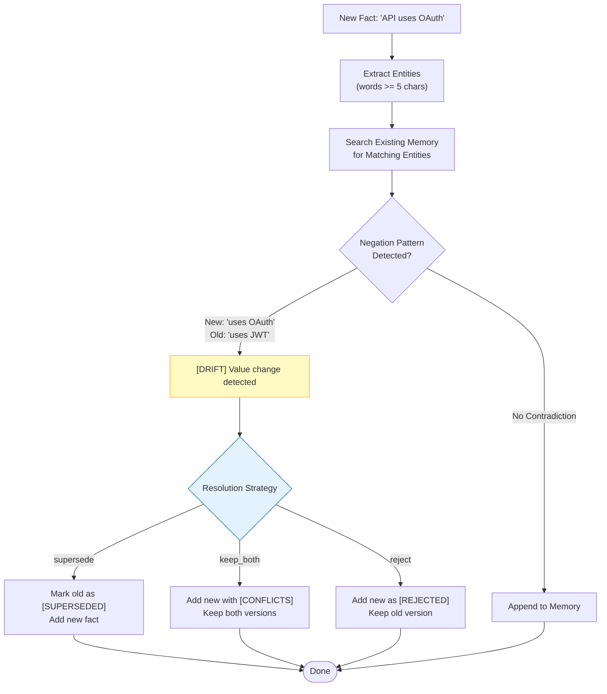

---

## Provider Routing

Euxis implements intelligent provider routing based on agent role, task priority, and capability requirements.

### Intelligence Tier Routing

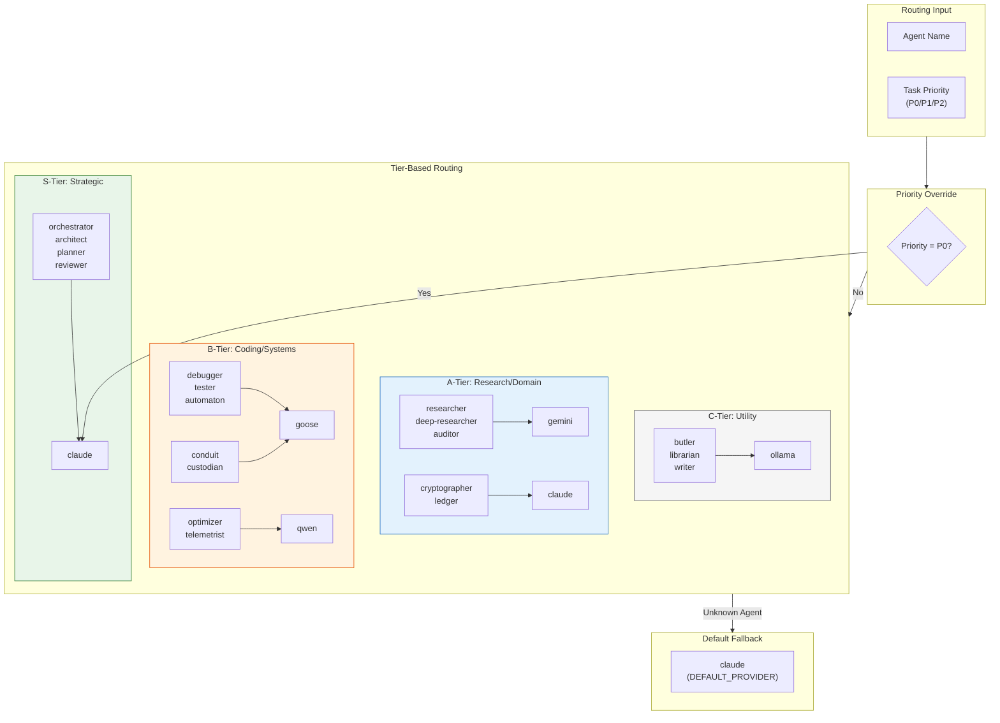

### Provider Selection Logic

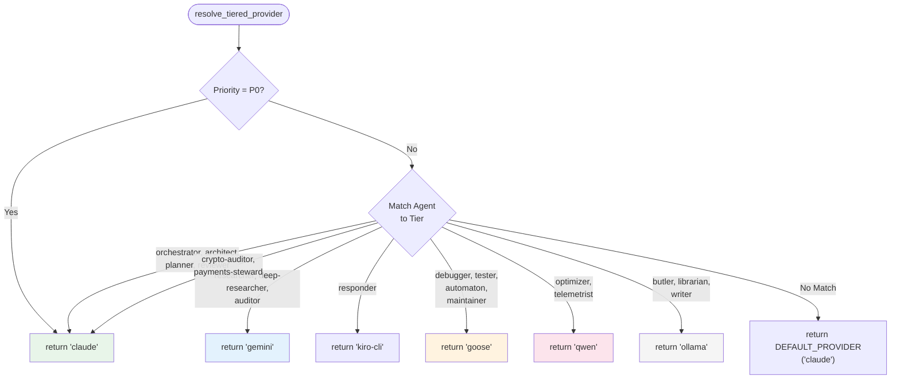

### Provider Fallback Mechanisms

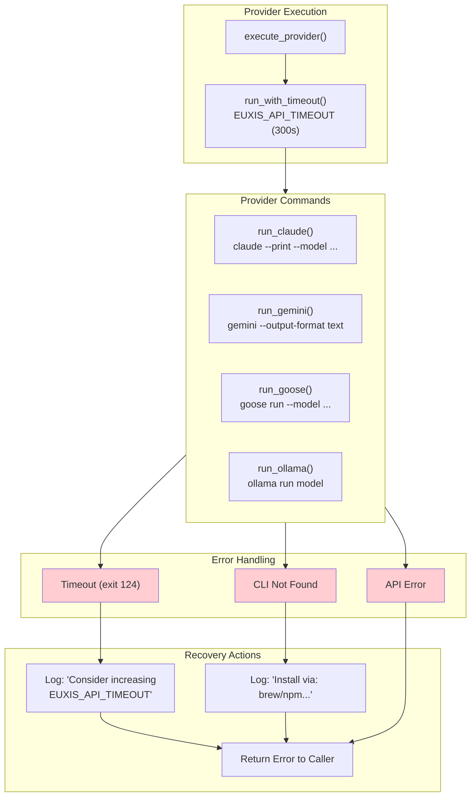

---

## Agent Lifecycle

Agents transition through a defined set of states during execution. The lifecycle system enables coordination overhead measurement and detection of stuck agents.

### State Diagram

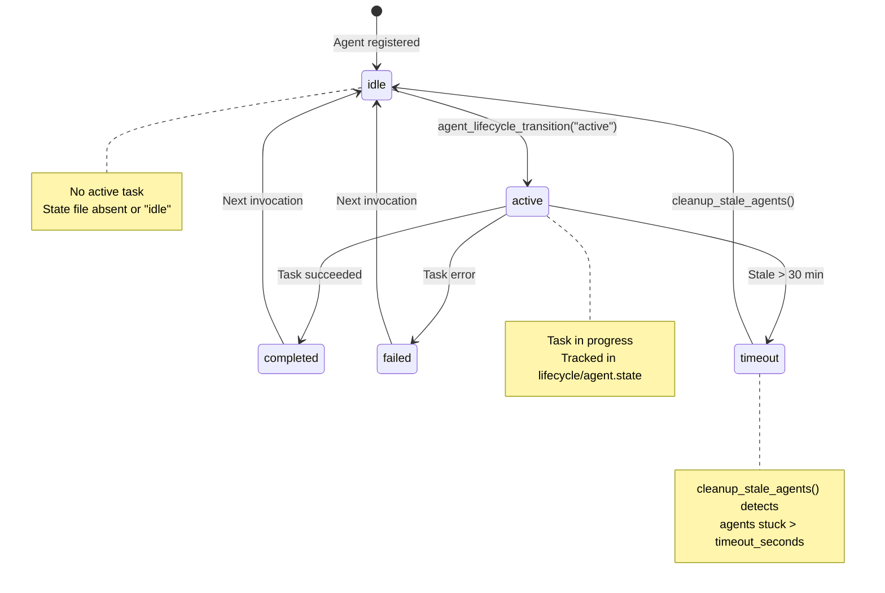

### Lifecycle State Flow

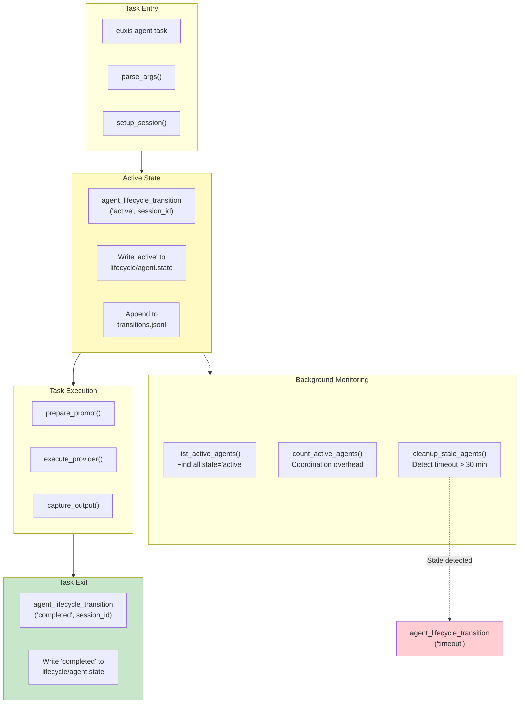

### Lifecycle Tracking Files

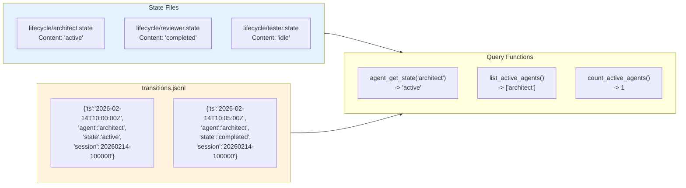

---

## Data Flow Summary

### Complete Request Flow

```mermaid
flowchart TB
    subgraph User["User Input"]
        cmd["euxis architect 'review auth system'"]
    end

    subgraph CLI["CLI Processing"]
        parse["parse_args()<br/>agent=architect<br/>task='review auth system'"]
        session["setup_session()<br/>Generate SESSION_ID"]
    end

    subgraph Lifecycle["Lifecycle Update"]
        active["Mark agent 'active'"]
    end

    subgraph Memory["Memory Assembly"]
        hot["Tier 1: Hot Memory<br/>(last 20 entries)"]
        relevant["Tier 2: Relevant Memory<br/>(keyword match)"]
        cross["Tier 3: Cross-Agent<br/>(sibling memory)"]
    end

    subgraph Prompt["Prompt Assembly"]
        template["Load agent prompt<br/>prompts/core/architect.txt"]
        protocols["Inject protocols<br/>constitution.md, etc."]
        memory_inject["Inject tiered memory"]
        task_inject["Inject sanitized task"]
    end

    subgraph Provider["Provider Execution"]
        resolve["resolve_tiered_provider()<br/>-> 'claude'"]
        config["resolve_provider_config()<br/>model, flags"]
        execute["run_claude()<br/>claude --print ..."]
    end

    subgraph Output["Output Capture"]
        capture["capture_output()<br/>Write to output/"]
        memory_update["Update memory.md"]
        complete["Mark agent 'completed'"]
    end

    User --> CLI
    CLI --> Lifecycle
    Lifecycle --> Memory
    Memory --> Prompt
    Prompt --> Provider
    Provider --> Output

    style Memory fill:#fff9c4
    style Prompt fill:#e3f2fd
    style Provider fill:#fce4ec
```

---

## Directory Structure

```
~/.euxis/
├── bin/                          # Executables
│   ├── euxis                    # Main entry point
│   ├── euxis-dispatch           # Multi-agent dispatch
│   ├── euxis-squad              # Squad deployment
│   ├── euxis-combo              # Sequential chains
│   ├── euxis-playbook           # Multi-phase workflows
│   ├── euxis-council            # Collaborative decisions
│   ├── euxis-loop               # Iterative execution
│   ├── euxis-bus                # Event bus
│   ├── euxis-graph              # Knowledge graph
│   └── lib/                     # Shell libraries
│       ├── agents.sh            # Agent discovery
│       ├── cli.sh               # Argument parsing
│       ├── common.sh            # Shared utilities
│       ├── dispatch.sh          # Command routing
│       ├── memory.sh            # Tiered memory
│       ├── prompt.sh            # Prompt assembly
│       ├── providers.sh         # Provider execution
│       ├── registry_sql.sh      # SQLite queries
│       ├── session.sh           # Session management
│       └── validation.sh        # Input validation
├── config/                       # Configuration
│   ├── patterns/                # Validation patterns
│   ├── playbooks/               # Playbook definitions
│   └── templates/               # Prompt templates
├── data/                         # Runtime data
│   ├── lifecycle/               # Agent state files
│   ├── projects/                # Project-specific data
│   └── registry_pool/           # Connection pool locks
├── docs/                         # Documentation
├── prompts/                      # Agent prompts
│   ├── core/                    # Core tier (9 agents)
│   ├── fleet/                   # Fleet tier (32 agents)
│   └── protocols/               # Shared protocol fragments
├── registry.db                   # SQLite agent registry
├── registry.json                 # JSON registry (fallback)
└── squads.json                   # Squad/combo definitions
```

---

*Euxis v0.0.8 - Build something that matters.*
